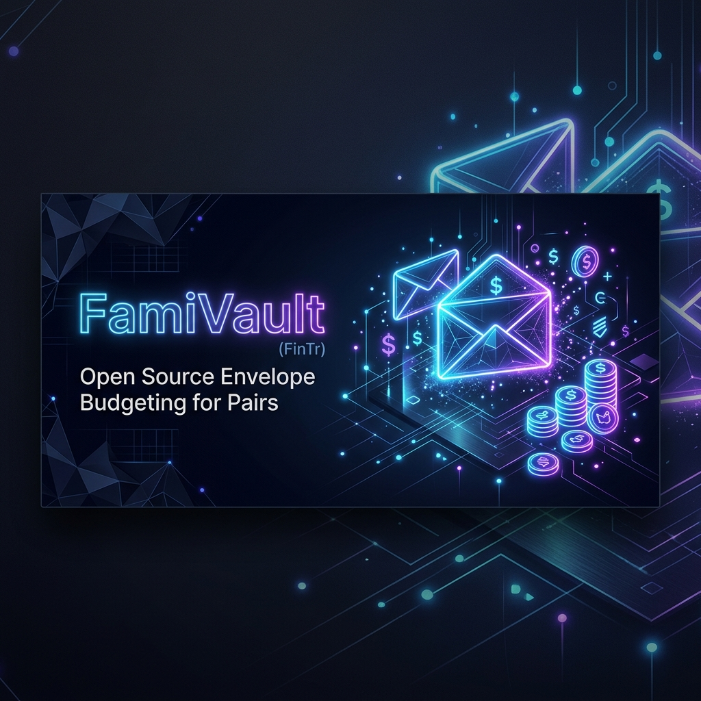
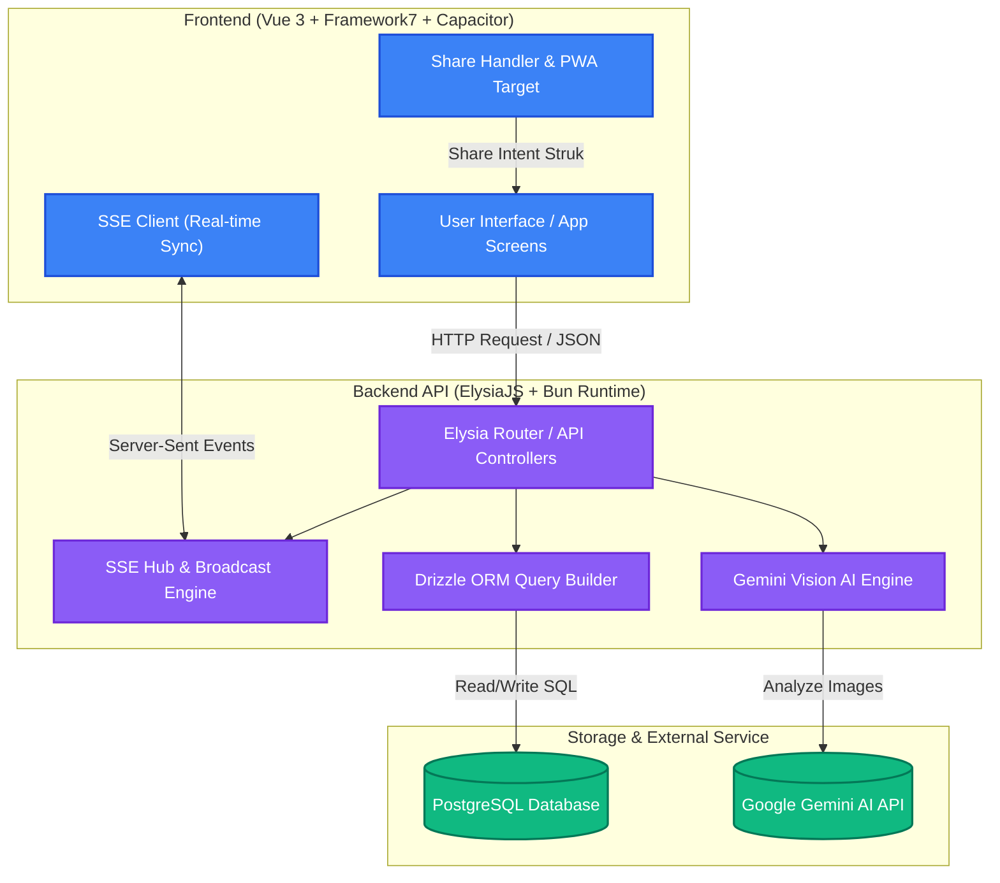
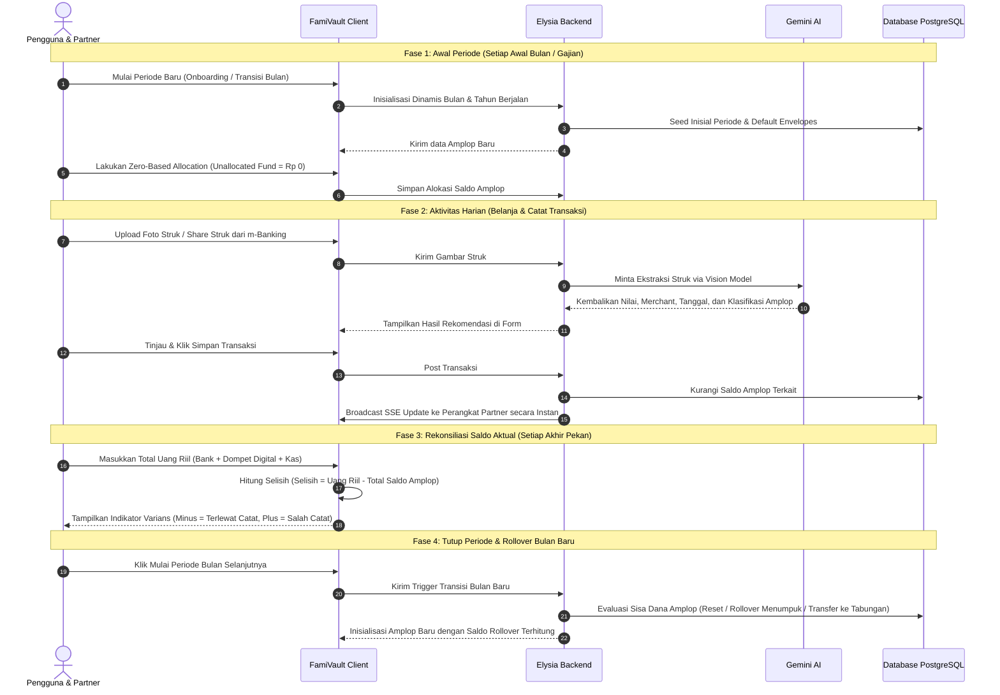

<p align="center">
  
</p>

<p align="center">
  <a href="https://github.com/ihkaru/fintr/actions/workflows/build-apk.yml">
    
  </a>
  <a href="https://bun.sh">
    
  </a>
  <a href="https://vuejs.org">
    
  </a>
  <a href="https://elysiajs.com">
    
  </a>
  <a href="https://ai.google.dev">
    
  </a>
  <a href="LICENSE">
    
  </a>
</p>

---

**FamiVault (FinTr)** adalah aplikasi penganggaran amplop berbasis _zero-based budgeting_ yang dirancang khusus untuk rumah tangga baru/pasangan. Ditenagai oleh arsitektur modern berkinerja tinggi, FamiVault memadukan kemudahan pencatatan harian otomatis lewat AI Vision OCR dengan sinkronisasi instan multi-perangkat.

> [!NOTE]
> Proyek ini menggunakan **Bun Workspace** (Monorepo) untuk backend dan frontend, menghasilkan latensi minimal dan kenyamanan penuh dalam pengembangan lokal maupun deployment produksi.

---

## 🎨 Fitur Unggulan

- 🎯 **Zero-Based Budgeting**: Alokasi penuh pendapatan bulanan ke dalam amplop anggaran secara presisi hingga sisa dana tidak teralokasi (_Unallocated Fund_) bernilai Rp 0.
- ✉️ **Sistem Amplop Reaktif**: Pantau sisa dana per kategori amplop secara reaktif lengkap dengan indikator batas aman anggaran, visualisasi warna, dan kustomisasi aturan _rollover_ akhir bulan.
- 🛍️ **Split Transactions**: Pecah pengeluaran dari satu struk belanja besar ke beberapa amplop anggaran berbeda secara fleksibel dalam satu form input tunggal dengan validasi saldo sisa yang ketat.
- 🤖 **AI OCR & Smart Receipt Scanning**: Unggah foto struk, bukti transfer, atau gunakan fitur _Share Target_ Android. Ditenagai oleh **Gemini Vision AI** untuk mengekstrak nominal, merchant, tanggal secara otomatis, serta mengklasifikasikan barang belanjaan ke rekomendasi amplop yang paling sesuai.
- ⚡ **Sinkronisasi Real-Time (SSE)**: Sinkronisasi instan data transaksi dan amplop anggaran antar perangkat pasangan menggunakan koneksi _Server-Sent Events_ (SSE) berkeamanan tinggi.
- 🔄 **Rekonsiliasi Saldo Aktual**: Widget interaktif yang membandingkan total anggaran tercatat di aplikasi dengan uang riil (bank + dompet digital + kas fisik) secara periodik demi menjaga keakuratan data 100%.
- 📱 **PWA & Android Native Optimization**: Integrasi Capacitor penuh dengan penanganan tombol kembali perangkat keras (_hardware back button_), _dirty-form checks_, dan dukungan _offline caching_.

---

## 🔌 Arsitektur Sistem

Berikut adalah alur aliran data dan komponen arsitektur monorepo FamiVault:



---

## 🔄 Siklus Penggunaan Aplikasi (User Lifecycle)

FamiVault memandu Anda dalam siklus pengelolaan keuangan yang sehat melalui empat fase berulang setiap bulannya:



---

## 🤝 Panduan Sinkronisasi Akun Pasangan

FamiVault dirancang untuk menjaga transparansi keuangan pasangan secara _real-time_. Berikut langkah untuk menghubungkan akun:

1.  **Dapatkan Kode Undangan**:
    - Buka menu **Pengaturan** (ikon gerigi di pojok kanan atas).
    - Pada kartu **Rumah Tangga**, salin 6-karakter **Kode Undangan** Anda (misal: `G7Y2K1`).
2.  **Hubungkan Akun Pasangan**:
    - Buka aplikasi FamiVault di HP pasangan, masuk ke menu **Pengaturan**.
    - Gulir ke kolom **Gabung Rumah Tangga Pasangan**, tempel kode tersebut lalu ketuk **Gabung**.
3.  **Status Terhubung di UI**:
    - **PartnerStatusBar**: Header dasbor utama akan berubah dari _"Menunggu Partner..."_ menjadi _"Alokasi Saling Terhubung"_ dengan avatar yang saling bertumpuk dan nama gabungan (contoh: _Ihsan & Partner_).
    - **Daftar Anggota**: Daftar lengkap anggota keluarga berstatus aktif beserta foto profil dan peran (`Owner` / `Anggota`) kini dapat dilihat di menu Pengaturan.

---

## 🛠️ Spesifikasi Teknologi

| Komponen                      | Teknologi                                   | Deskripsi                                                           |
| :---------------------------- | :------------------------------------------ | :------------------------------------------------------------------ |
| **Runtime & Package Manager** | [Bun](https://bun.sh/)                      | Eksekusi backend & client monorepo cepat secepat kilat              |
| **Backend API**               | [ElysiaJS](https://elysiajs.com/)           | Framework API TypeScript dengan performa tinggi & type safety penuh |
| **Database ORM**              | [Drizzle ORM](https://orm.drizzle.team/)    | Query builder SQL reaktif, ringan, dan bersahabat dengan migrasi    |
| **Database Server**           | [PostgreSQL](https://www.postgresql.org/)   | Sistem penyimpanan data relasional tangguh                          |
| **Kecerdasan Buatan (AI)**    | [Gemini Vision API](https://ai.google.dev/) | OCR cerdas pengekstrak struk belanja & klasifikasi barang           |
| **Frontend Framework**        | [Vue 3](https://vuejs.org/)                 | Framework web reaktif menggunakan Composition API                   |
| **UI Framework**              | [Framework7 v9](https://framework7.io/)     | Komponen antarmuka berciri khas native mobile iOS/Android           |
| **Kompilator Aplikasi**       | [Capacitor](https://capacitorjs.com/)       | Pembungkus web app menjadi aplikasi native Android (APK)            |

---

## 🚀 Memulai Pengembangan Lokal

### Prasyarat System

- [Bun](https://bun.sh/) (Versi terbaru)
- [Docker & Docker Compose](https://www.docker.com/) (Untuk database lokal PostgreSQL)
- Google Cloud Console Project (Untuk Google OAuth)
- Kunci API Google Gemini (Vision API)

### 1. Salin Pengaturan Lingkungan (Environment)

Buat file konfigurasi `.env` pada direktori root (salin template dari `.env.example`):

```bash
cp .env.example .env
```

Lalu salin file konfigurasi `.env` untuk packages API:

```bash
cp packages/api/.env.example packages/api/.env
```

> [!IMPORTANT]
> Pastikan Anda telah mengisi nilai variabel lingkungan penting di file `packages/api/.env` seperti `DATABASE_URL`, `GOOGLE_CLIENT_ID`, dan `GEMINI_API_KEY`.

### 2. Pasang Dependensi Proyek

Jalankan perintah berikut di direktori root untuk memasang dependensi monorepo:

```bash
bun install
```

### 3. Jalankan Server Pengembangan

Kami telah menyediakan skrip automasi pengaktifan server pengembangan yang aman dari konflik port:

```bash
./dev.sh
```

**Kelebihan Skrip `./dev.sh`:**

1.  **Deteksi Konflik Port**: Mendeteksi jika port database (`5432` / port pilihan Anda) sudah digunakan oleh container atau postgres lokal lain.
2.  **Pembersihan Otomatis**: Secara otomatis mematikan sisa proses Bun tidak berizin yang menggantung di port API (`3001`) dan Client (`5173`).
3.  **Pemberhentian yang Bersih**: Menekan `Ctrl + C` pada terminal akan mematikan seluruh proses database docker dan server dev secara aman dan bersamaan.

---

## 📱 Uji Coba PWA & Android Share Target

Untuk mencoba fitur integrasi _Share Target_ (membagikan struk digital m-banking secara langsung dari galeri HP ke aplikasi FamiVault):

1.  Sambungkan perangkat Android asli Anda menggunakan USB debugging atau buka Android Emulator.
2.  Lakukan port forwarding client dan API server lokal agar dapat diakses dari dalam perangkat Android:
    ```bash
    adb reverse tcp:5173 tcp:5173
    adb reverse tcp:3001 tcp:3001
    ```
3.  Buka Google Chrome di Android, lalu navigasikan ke alamat `http://localhost:5173`.
4.  Ketuk tombol menu Chrome lalu pilih **"Tambahkan ke Layar Utama" (Add to Home Screen)** untuk memasang PWA.
5.  Kini Anda dapat memilih gambar struk di galeri Anda, klik bagikan (Share), lalu pilih ikon **FamiVault** untuk langsung masuk ke form pengeluaran dengan data struk yang diekstrak otomatis!

---

## 📦 Pipa Rilis Otomatis (Build Android APK)

Repositori ini dilengkapi dengan **GitHub Actions Workflow** yang akan mengkompilasi aplikasi native Android Anda secara otomatis saat Anda merilis versi baru.

- **Pemicu Build**: Cukup buat tag baru berawalan `v*` dan dorong ke repositori:
  ```bash
  git tag v1.0.14 -m "Rilis Fitur Baru"
  git push origin v1.0.14
  ```
- **Hasil Output**: File APK siap pakai (`FamiVault-release.apk`) akan terkompilasi, ditandatangani, dan otomatis diunggah ke rilis baru di halaman GitHub Releases proyek Anda.

---

## 📜 Lisensi

Proyek ini dilisensikan di bawah **MIT License**. Lihat berkas [LICENSE](LICENSE) untuk rincian selengkapnya.
