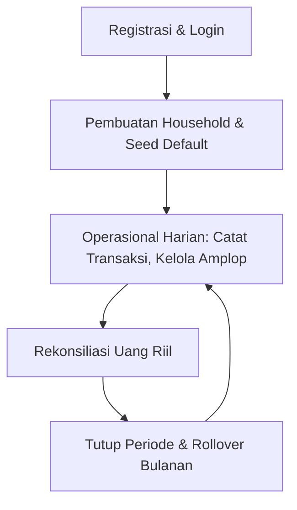

# ⚙️ Dokumentasi Proses Bisnis & Analisis Alur FamiVault

Dokumen ini memetakan seluruh proses bisnis aplikasi FamiVault dari onboarding pertama kali, aktivitas harian, hingga penutupan siklus bulanan (rollover). Dokumen ini juga menganalisis skenario **Happy Path** (kondisi ideal) dan **Unhappy Path** (kondisi anomali/eror) untuk memastikan perilaku (_behavior_) sistem tetap logis, aman, dan konsisten bagi pengguna.

---

## 🔄 1. Peta Siklus Pengguna (User Lifecycle)

Siklus hidup data dan aktivitas pengguna di FamiVault dibagi menjadi 4 fase utama yang saling terhubung:

### Fase A: Onboarding & Login Pertama Kali

1. **Otentikasi**: Pengguna masuk via Google Sign-In (Native Credential Manager pada Android, atau Web OAuth pada browser).
2. **Identifikasi Rumah Tangga (_Household_)**:
   - Jika pengguna baru mendaftar, backend secara otomatis membuat entri `household` baru dan menetapkan pengguna tersebut sebagai `Owner`.
   - Jika pengguna mendaftar melalui kode undangan pasangan, mereka langsung bergabung ke `household` yang sudah ada sebagai `Anggota`.
3. **Inisialisasi Data Awal (Seeding & Self-Healing)**:
   - Jika pengguna baru membuat `household` baru, sistem memicu pembuatan template amplop default (e.g. Belanja Mingguan, Uang Kos, Tabungan) dan periode anggaran aktif untuk bulan & tahun berjalan saat ini.

### Fase B: Aktivitas Harian & Transaksi

1. Pengguna memasukkan transaksi pengeluaran melalui 3 metode:
   - **Input Manual**: Mengisi form nama transaksi, nominal, dan memilih kategori amplop.
   - **Gemini Vision AI (OCR)**: Mengambil/mengunggah foto struk belanja. Gemini mengekstrak total nominal, merchant, tanggal, serta menyarankan klasifikasi amplop yang sesuai.
   - **Android Share Target**: Membagikan tangkapan layar/pdf struk m-banking langsung dari galeri HP ke PWA FamiVault untuk diekstrak otomatis.
2. Setiap transaksi yang tersimpan akan memotong sisa saldo alokasi berjalan amplop tersebut.
3. Perubahan saldo dan penambahan transaksi **disiarkan secara instan** via Server-Sent Events (SSE) ke perangkat pasangan yang terhubung dalam satu household.

### Fase C: Rekonsiliasi Mingguan

1. Pengguna memasukkan total uang fisik & digital riil mereka (Bank + Dompet Digital + Uang Tunai).
2. Aplikasi menghitung varians (selisih): `Selisih = Uang Riil - Total Sisa Saldo Amplop`.
3. Jika selisih bernilai negatif, berarti ada pengeluaran yang lupa dicatat. Jika positif, terdapat kesalahan pencatatan saldo awal atau penerimaan dana yang belum dialokasikan.

### Fase D: Rollover & Looping Bulanan

1. Di akhir bulan, pengguna mengeklik **"Tutup Periode"** untuk bertransisi ke bulan baru.
2. Sistem mengevaluasi sisa saldo pada masing-masing amplop berdasarkan perilaku rollover masing-masing:
   - **Reset**: Sisa saldo dihanguskan (kembali ke `0.00`).
   - **Rollover**: Sisa saldo diakumulasikan ke bulan berikutnya sebagai dana tambahan.
   - **Transfer ke Tabungan**: Sisa saldo dipindahkan ke amplop khusus kategori Tabungan/Investasi (jika template amplop "Tabungan" tidak aktif atau tidak ditemukan, sistem otomatis memulihkan/membuat ulang template tersebut agar dana sisa tidak hilang secara diam-diam).
3. Sistem membuka periode baru dan menyalin template amplop aktif beserta sisa saldo rollover yang dihitung.

---

## 🔍 2. Analisis Happy Path & Unhappy Path

Untuk menjaga konsistensi database dan kejelasan UX, berikut adalah analisis skenario operasional beserta perilakunya:

### 📑 A. Skenario Bergabung ke Rumah Tangga Pasangan

Skenario saat pengguna memutuskan bergabung ke rumah tangga pasangan lewat kode undangan.

| Alur                               | Deskripsi Perilaku Sistem                                                                                                                                                                                                                                         | Evaluasi UX & Konsistensi                                                                                                                                                                                                                                                                                                 |
| :--------------------------------- | :---------------------------------------------------------------------------------------------------------------------------------------------------------------------------------------------------------------------------------------------------------------- | :------------------------------------------------------------------------------------------------------------------------------------------------------------------------------------------------------------------------------------------------------------------------------------------------------------------------ |
| **Happy Path**                     | Pengguna memasukkan kode undangan pasangan $\rightarrow$ Household mereka diubah ke ID pasangan $\rightarrow$ Halaman Home langsung memuat ulang daftar amplop dan periode berjalan pasangan $\rightarrow$ Status bar berubah menjadi "Alokasi Saling Terhubung". | Pengguna langsung melihat data keuangan yang sama secara real-time tanpa perlu me-restart aplikasi.                                                                                                                                                                                                                       |
| **Unhappy Path (Data Orphaned)**   | Pengguna sempat membuat transaksi di household-nya sendiri sebelum bergabung ke household pasangan $\rightarrow$ Transaksi lama tersebut tertinggal di database dengan household lama yang ditinggalkan.                                                          | **Solusi (Terimplementasi v1.0.19)**: Backend secara ketat menolak permintaan penggabungan rumah tangga (`POST /join-household`) jika pengguna sudah memiliki data transaksi tercatat (mengembalikan status `400 Bad Request` dengan pesan error yang jelas). Hal ini mencegah transaksi lama yatim/orphaned di database. |
| **Unhappy Path (Periode Berbeda)** | Pasangan memiliki periode aktif berjalan (misal: Juni 2026), namun pengguna baru baru login pertama kali.                                                                                                                                                         | **Solusi (_Self-Healing_)**: Saat pengguna baru membuka halaman Home, sistem secara otomatis mengecek apakah ada amplop aktif pasangan yang belum teralokasikan untuk pengguna baru ini. Fungsi self-healing di endpoint `GET /periods/:id` otomatis membuat alokasi yang hilang secara transparan.                       |

---

### 📑 B. Skenario Pengeditan Nominal Anggaran Amplop

Skenario ketika pengguna mengedit nilai anggaran bulanan default di menu "Kelola Amplop".

| Alur                                | Deskripsi Perilaku Sistem                                                                                                                                                                                                                                                                                        | Evaluasi UX & Konsistensi                                                                                                                                                                                                                                                                                 |
| :---------------------------------- | :--------------------------------------------------------------------------------------------------------------------------------------------------------------------------------------------------------------------------------------------------------------------------------------------------------------- | :-------------------------------------------------------------------------------------------------------------------------------------------------------------------------------------------------------------------------------------------------------------------------------------------------------- |
| **Happy Path**                      | Pengguna mengedit nominal default amplop dari Rp 500.000 menjadi Rp 750.000 $\rightarrow$ Nilai default di template ter-update $\rightarrow$ Alokasi periode aktif berjalan otomatis ikut berubah menjadi Rp 750.000 $\rightarrow$ Halaman Home langsung memperbarui nilai target dan sisa saldo amplop terkait. | Perubahan langsung dirasakan di bulan berjalan. Pengguna tidak perlu menunggu hingga rollover bulan depan hanya untuk mengoreksi batas anggaran bulan ini.                                                                                                                                                |
| **Unhappy Path (Over-budgeting)**   | Pengguna menurunkan nominal anggaran default (misal dari Rp 500.000 menjadi Rp 200.000), padahal mereka **sudah membelanjakan Rp 300.000** di bulan berjalan ini.                                                                                                                                                | **Solusi**: Sistem tetap mengizinkan pembaruan alokasi berjalan di database, namun UI menampilkan sisa saldo amplop tersebut sebagai **negatif** (e.g. `Sisa: -Rp 100.000`) dengan indikator warna merah cerah, memperingatkan pengguna bahwa mereka telah melampaui batas anggaran baru yang ditetapkan. |
| **Unhappy Path (Periode Tertutup)** | Pengguna mengharapkan perubahan nominal ini juga mengubah catatan bulan-bulan sebelumnya yang sudah ditutup untuk merapikan laporan masa lalu.                                                                                                                                                                   | **Solusi**: Sistem **membatasi perubahan alokasi secara ketat** hanya pada periode berjalan yang berstatus aktif (`isClosed: false`). Data periode masa lalu (`isClosed: true`) dibekukan untuk menjaga integritas data historis demi keakuratan laporan laporan tahunan.                                 |

---

### 📑 C. Skenario Penghapusan Amplop (Soft Delete)

Skenario saat pengguna menghapus amplop di menu "Kelola Amplop".

| Alur                                       | Deskripsi Perilaku Sistem                                                                                                                                                                                                                                                                                                                   | Evaluasi UX & Konsistensi                                                                                                                                                                                                                    |
| :----------------------------------------- | :------------------------------------------------------------------------------------------------------------------------------------------------------------------------------------------------------------------------------------------------------------------------------------------------------------------------------------------ | :------------------------------------------------------------------------------------------------------------------------------------------------------------------------------------------------------------------------------------------- |
| **Happy Path (Belum Ada Transaksi)**       | Pengguna menghapus amplop $\rightarrow$ Template amplop diubah menjadi `isActive: false` $\rightarrow$ Sistem memeriksa alokasi periode aktif berjalan $\rightarrow$ Karena belum ada transaksi terkait, baris alokasi di database **ikut dihapus secara permanen** $\rightarrow$ Amplop langsung hilang dari Home.                         | Halaman Home langsung bersih dari amplop yang batal digunakan tanpa meninggalkan sampah relasi data (_clean clean-up_).                                                                                                                      |
| **Happy Path (Sudah Ada Transaksi)**       | Pengguna menghapus amplop $\rightarrow$ Template diubah menjadi `isActive: false` $\rightarrow$ Sistem memeriksa alokasi periode aktif $\rightarrow$ Karena **sudah ada transaksi**, baris alokasi tetap dipertahankan $\rightarrow$ Halaman Home tetap menampilkan amplop tersebut untuk periode berjalan agar neraca balance tetap valid. | Data historis transaksi pengguna tetap aman dan neraca keuangan bulan ini tidak rusak. Amplop tersebut baru akan benar-benar tidak muncul pada periode bulan depan (setelah rollover).                                                       |
| **Unhappy Path (Kategori Transaksi Baru)** | Setelah amplop dinonaktifkan (`isActive: false`), pengguna mencoba mencatat transaksi baru pada amplop tersebut.                                                                                                                                                                                                                            | **Solusi**: Dropdown pilihan kategori pada formulir "Tambah Transaksi" secara aktif memfilter dan **hanya menampilkan amplop yang berstatus `isActive: true`**. Ini mencegah adanya transaksi baru masuk ke dalam amplop yang sudah dihapus. |

---

### 📑 D. Skenario Keterlambatan Login / Periode Kosong

Skenario ketika pengguna tidak membuka aplikasi selama beberapa bulan, kemudian kembali masuk.

| Alur                                                     | Deskripsi Perilaku Sistem                                                                                                                                                                                                                                                               | Evaluasi UX & Konsistensi                                                                                                                                                                                                                                                                                 |
| :------------------------------------------------------- | :-------------------------------------------------------------------------------------------------------------------------------------------------------------------------------------------------------------------------------------------------------------------------------------- | :-------------------------------------------------------------------------------------------------------------------------------------------------------------------------------------------------------------------------------------------------------------------------------------------------------- |
| **Happy Path**                                           | Pengguna membuka aplikasi $\rightarrow$ Sistem mendeteksi periode aktif terakhir berada di masa lalu dan **memiliki catatan transaksi** $\rightarrow$ Aplikasi menyarankan pengguna untuk menutup periode secara beruntun (_cascade rollover_) hingga mencapai bulan berjalan saat ini. | Saldo rollover terhitung secara runtut dan masuk akal, menjaga keakuratan sisa uang yang terakumulasi.                                                                                                                                                                                                    |
| **Unhappy Path (Fast-Forward)**                          | Pengguna baru login pertama kali $\rightarrow$ Database awal terisi seed lama (Juni 2025) dengan **jumlah transaksi = 0** $\rightarrow$ Pengguna bingung mengapa tanggal anggaran mereka berada di masa lalu.                                                                           | **Solusi**: Sistem secara otomatis mendeteksi jika hanya ada 1 periode lama dengan transaksi 0, lalu melakukan _fast-forward_ (memperbarui bulan & tahun periode tersebut ke tanggal hari ini secara langsung di database). Pengguna langsung masuk ke periode aktif saat ini secara instan.              |
| **Unhappy Path (Bulan Terlewat Banyak Tanpa Transaksi)** | Pengguna tidak aktif selama 3 mana terakhir aktif Maret, sekarang Juni) dan tidak ada transaksi sama sekali di April dan Mei.                                                                                                                                                           | **Solusi**: Ketika rollover dijalankan dari Maret, sistem mendeteksi kelompangan tersebut. Pengguna diberikan opsi apakah ingin membuat periode kosong beruntun (untuk mencatat riwayat tertunda) atau langsung melompat ke Juni dengan saldo sisa Maret dipindahkan secara utuh sebagai saldo awal Juni. |

---

## 🛠️ 3. Rekomendasi Pengembangan Masa Depan

Berdasarkan analisis Happy & Unhappy Path di atas, berikut adalah beberapa perbaikan operasional yang direkomendasikan untuk pengembangan jangka panjang:

1. **Validasi Sebelum Gabung Rumah Tangga (Terimplementasi v1.0.19)**: Validasi filter backend telah diterapkan pada endpoint `/join-household` untuk memblokir aksi penggabungan apabila terdapat catatan transaksi pada household lama guna melindungi integritas data.
2. **Keamanan Saldo Rollover saat Amplop "Tabungan" Hilang (Terimplementasi v1.0.20)**: Apabila terdapat alokasi dengan behavior `rollover_to_savings` namun template amplop `"Tabungan"` telah dihapus/dinonaktifkan oleh pengguna, sistem secara otomatis akan memulihkan atau membuat ulang template `"Tabungan"` baru di akhir periode agar sisa saldo tidak hilang secara diam-diam.
3. **Riwayat Rollover Terpusat**: Menyimpan log khusus rollover yang mencatat berapa sisa dana yang di-reset, di-rollover, atau ditransfer ke tabungan di setiap akhir bulan sebagai bahan laporan audit tahunan pengguna.
4. **Mekanisme Sinkronisasi Offline**: Menambahkan antrean transaksi di local storage (IndexedDB) di sisi client PWA agar pengguna tetap bisa mencatat pengeluaran saat tidak ada sinyal internet, dan otomatis melakukan sinkronisasi (_sync back_) saat koneksi terdeteksi kembali.
