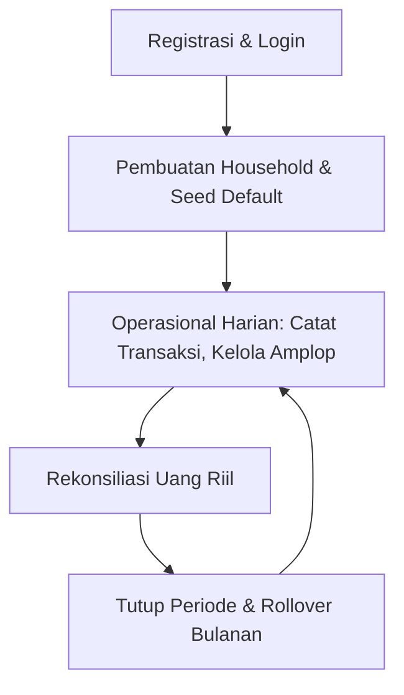
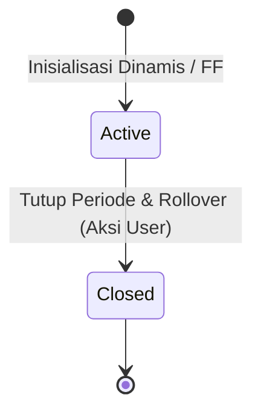
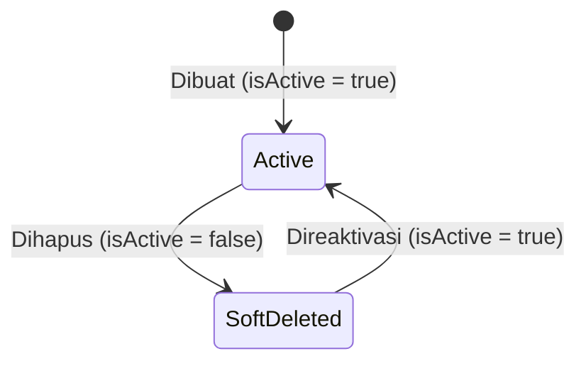

# ⚙️ Dokumentasi Proses Bisnis & Analisis Alur FamiVault

Dokumen ini memetakan seluruh proses bisnis aplikasi FamiVault dari onboarding pertama kali, aktivitas harian, hingga penutupan siklus bulanan (rollover). Dokumen ini juga menganalisis skenario **Happy Path** (kondisi ideal) dan **Unhappy Path** (kondisi anomali/eror) untuk memastikan perilaku (_behavior_) sistem tetap logis, aman, dan konsisten bagi pengguna.

---

## 🔄 1. Peta Siklus Pengguna (User Lifecycle)

Siklus hidup data dan aktivitas pengguna di FamiVault dibagi menjadi 4 fase utama yang saling terhubung:



### Fase A: Onboarding & Login Pertama Kali

1. **Otentikasi**: Pengguna masuk via Google Sign-In (Native Credential Manager pada Android, atau Web OAuth pada browser).
2. **Identifikasi Rumah Tangga (_Household_)**:
   - Jika pengguna baru mendaftar, backend secara otomatis membuat entri `household` baru dan menetapkan pengguna tersebut sebagai `Owner`.
   - Jika pengguna mendaftar melalui kode undangan pasangan, mereka langsung bergabung ke `household` yang sudah ada sebagai `Anggota`.
3. **Inisialisasi Data Awal (Seeding & Self-Healing)**:
   - Jika pengguna baru membuat `household` baru, sistem memicu pembuatan template amplop default (e.g. Belanja Mingguan, Uang Kos, Tabungan) dan periode anggaran aktif untuk bulan & tahun berjalan saat ini.

### Fase B: Aktivitas Harian & Transaksi

1. Pengguna memasukkan transaksi pengeluaran melalui 3 metode:
   - **Input Manual**: Mengisi form nama transaksi, nominal, dan memilih kategori amplop.
   - **Gemini Vision AI (OCR)**: Mengambil/mengunggah foto struk belanja. Gemini mengekstrak total nominal, merchant, tanggal, serta menyarankan klasifikasi amplop yang sesuai.
   - **Android Share Target**: Membagikan tangkapan layar/pdf struk m-banking langsung dari galeri HP ke PWA FamiVault untuk diekstrak otomatis.
2. Setiap transaksi yang tersimpan akan memotong sisa saldo alokasi berjalan amplop tersebut.
3. Perubahan saldo dan penambahan transaksi **disiarkan secara instan** via Server-Sent Events (SSE) ke perangkat pasangan yang terhubung dalam satu household.

### Fase C: Rekonsiliasi Mingguan

1. Pengguna memasukkan total uang fisik & digital riil mereka (Bank + Dompet Digital + Uang Tunai).
2. Aplikasi menghitung varians (selisih): `Selisih = Uang Riil - Total Sisa Saldo Amplop`.
3. Jika selisih bernilai negatif, berarti ada pengeluaran yang lupa dicatat. Jika positif, terdapat kesalahan pencatatan saldo awal atau penerimaan dana yang belum dialokasikan.

### Fase D: Rollover & Looping Bulanan

1. Di akhir bulan, pengguna mengeklik **"Tutup Periode"** pada menu Pengaturan.
2. Aplikasi memunculkan **Pratinjau Rollover & Smart Insights Sheet** yang mengkalkulasi total dana tersisa secara real-time, dana yang akan otomatis dipindahkan ke Tabungan, dana yang akan tetap di amplop, serta memperingatkan jika ada sisa dana yang akan hangus/di-reset ke nol.
3. Setelah dikonfirmasi, sistem mengevaluasi sisa saldo pada masing-masing amplop berdasarkan perilaku rollover masing-masing:
   - **Reset**: Sisa saldo dihanguskan (kembali ke `0.00`).
   - **Rollover**: Sisa saldo diakumulasikan ke bulan berikutnya sebagai dana tambahan.
   - **Transfer ke Tabungan**: Sisa saldo dipindahkan ke amplop khusus kategori Tabungan/Investasi (jika template amplop "Tabungan" tidak aktif atau tidak ditemukan, sistem otomatis memulihkan/membuat ulang template tersebut agar dana sisa tidak hilang secara diam-diam).
4. Sistem mencatat seluruh histori pemindahan sisa dana ini ke tabel audit `rollover_logs` untuk dianalisis oleh pengguna pada menu analisis anggaran.
5. Sistem membuka periode baru dan menyalin template amplop aktif beserta sisa saldo rollover yang dihitung.

---

## 🔍 2. Analisis Happy Path & Unhappy Path

Untuk menjaga konsistensi database dan kejelasan UX, berikut adalah analisis skenario operasional beserta perilakunya:

### 📑 A. Skenario Bergabung ke Rumah Tangga Pasangan

Skenario saat pengguna memutuskan bergabung ke rumah tangga pasangan lewat kode undangan.

| Alur                               | Deskripsi Perilaku Sistem                                                                                                                                                                                                                                         | Evaluasi UX & Konsistensi                                                                                                                                                                                                                                                                                                                                                                                                                                                                                                                         |
| :--------------------------------- | :---------------------------------------------------------------------------------------------------------------------------------------------------------------------------------------------------------------------------------------------------------------- | :------------------------------------------------------------------------------------------------------------------------------------------------------------------------------------------------------------------------------------------------------------------------------------------------------------------------------------------------------------------------------------------------------------------------------------------------------------------------------------------------------------------------------------------------ |
| **Happy Path**                     | Pengguna memasukkan kode undangan pasangan $\rightarrow$ Household mereka diubah ke ID pasangan $\rightarrow$ Halaman Home langsung memuat ulang daftar amplop dan periode berjalan pasangan $\rightarrow$ Status bar berubah menjadi "Alokasi Saling Terhubung". | Pengguna langsung melihat data keuangan yang sama secara real-time tanpa perlu me-restart aplikasi.                                                                                                                                                                                                                                                                                                                                                                                                                                               |
| **Unhappy Path (Data Orphaned)**   | Pengguna sempat membuat transaksi di household-nya sendiri sebelum bergabung ke household pasangan $\rightarrow$ Transaksi lama tersebut tertinggal di database dengan household lama yang ditinggalkan.                                                          | **Solusi (Terimplementasi v1.0.25)**: Backend secara ketat menolak permintaan penggabungan rumah tangga (`POST /join-household`) jika pengguna memiliki data transaksi tercatat (mengembalikan status `400 Bad Request` dengan kode `HOUSEHOLD_JOIN_BLOCKED_EXISTING_DATA`). Pengguna dapat mengabaikan blokir ini dengan menyetujui opsi hapus transaksi (`forceDeleteTransactions: true`) pada dialog konfirmasi UI, yang akan membersihkan seluruh catatan transaksi lama pengguna sebelum menggabungkan mereka ke household baru secara aman. |
| **Unhappy Path (Periode Berbeda)** | Pasangan memiliki periode aktif berjalan (misal: Juni 2026), namun pengguna baru baru login pertama kali.                                                                                                                                                         | **Solusi (_Self-Healing_)**: Saat pengguna baru membuka halaman Home, sistem secara otomatis mengecek apakah ada amplop aktif pasangan yang belum teralokasikan untuk pengguna baru ini. Fungsi self-healing di endpoint `GET /periods/:id` otomatis membuat alokasi yang hilang secara transparan.                                                                                                                                                                                                                                               |

---

### 📑 B. Skenario Pengeditan Nominal Anggaran Amplop

Skenario ketika pengguna mengedit nilai anggaran bulanan default di menu "Kelola Amplop".

| Alur                                | Deskripsi Perilaku Sistem                                                                                                                                                                                                                                                                                        | Evaluasi UX & Konsistensi                                                                                                                                                                                                                                                                                                                                                                                                                                             |
| :---------------------------------- | :--------------------------------------------------------------------------------------------------------------------------------------------------------------------------------------------------------------------------------------------------------------------------------------------------------------- | :-------------------------------------------------------------------------------------------------------------------------------------------------------------------------------------------------------------------------------------------------------------------------------------------------------------------------------------------------------------------------------------------------------------------------------------------------------------------- |
| **Happy Path**                      | Pengguna mengedit nominal default amplop dari Rp 500.000 menjadi Rp 750.000 $\rightarrow$ Nilai default di template ter-update $\rightarrow$ Alokasi periode aktif berjalan otomatis ikut berubah menjadi Rp 750.000 $\rightarrow$ Halaman Home langsung memperbarui nilai target dan sisa saldo amplop terkait. | Perubahan langsung dirasakan di bulan berjalan. Pengguna tidak perlu menunggu hingga rollover bulan depan hanya untuk mengoreksi batas anggaran bulan ini.                                                                                                                                                                                                                                                                                                            |
| **Unhappy Path (Over-budgeting)**   | Pengguna menurunkan nominal anggaran default (misal dari Rp 500.000 menjadi Rp 200.000), padahal mereka **sudah membelanjakan Rp 300.000** di bulan berjalan ini.                                                                                                                                                | **Solusi (Terimplementasi v1.0.25)**: Sistem tetap mengizinkan pembaruan alokasi berjalan di database, namun UI menampilkan sisa saldo amplop tersebut sebagai **negatif** (e.g. `Sisa: -Rp 100.000`) dengan indikator warna merah cerah. Sebelum perubahan disimpan, UI memicu dialog konfirmasi pra-aksi yang membandingkan nominal anggaran lama vs baru secara visual dan memperingatkan pengguna mengenai dampak retroaktif pada alokasi periode aktif berjalan. |
| **Unhappy Path (Periode Tertutup)** | Pengguna mengharapkan perubahan nominal ini juga mengubah catatan bulan-bulan sebelumnya yang sudah ditutup untuk merapikan laporan masa lalu.                                                                                                                                                                   | **Solusi**: Sistem **membatasi perubahan alokasi secara ketat** hanya pada periode berjalan yang berstatus aktif (`isClosed: false`). Data periode masa lalu (`isClosed: true`) dibekukan untuk menjaga integritas data historis demi keakuratan laporan laporan tahunan.                                                                                                                                                                                             |

---

### 📑 C. Skenario Penghapusan Amplop (Soft Delete)

Skenario saat pengguna menghapus amplop di menu "Kelola Amplop".

| Alur                                       | Deskripsi Perilaku Sistem                                                                                                                                                                                                                                                                                                                   | Evaluasi UX & Konsistensi                                                                                                                                                                                                                                                                                                                                                                                                                     |
| :----------------------------------------- | :------------------------------------------------------------------------------------------------------------------------------------------------------------------------------------------------------------------------------------------------------------------------------------------------------------------------------------------ | :-------------------------------------------------------------------------------------------------------------------------------------------------------------------------------------------------------------------------------------------------------------------------------------------------------------------------------------------------------------------------------------------------------------------------------------------- |
| **Happy Path (Belum Ada Transaksi)**       | Pengguna menghapus amplop $\rightarrow$ Template amplop diubah menjadi `isActive: false` $\rightarrow$ Sistem memeriksa alokasi periode aktif berjalan $\rightarrow$ Karena belum ada transaksi terkait, baris alokasi di database **ikut dihapus secara permanen** $\rightarrow$ Amplop langsung hilang dari Home.                         | Halaman Home langsung bersih dari amplop yang batal digunakan tanpa meninggalkan sampah relasi data (_clean clean-up_).                                                                                                                                                                                                                                                                                                                       |
| **Happy Path (Sudah Ada Transaksi)**       | Pengguna menghapus amplop $\rightarrow$ Template diubah menjadi `isActive: false` $\rightarrow$ Sistem memeriksa alokasi periode aktif $\rightarrow$ Karena **sudah ada transaksi**, baris alokasi tetap dipertahankan $\rightarrow$ Halaman Home tetap menampilkan amplop tersebut untuk periode berjalan agar neraca balance tetap valid. | **Solusi (Terimplementasi v1.0.25)**: Data historis transaksi tetap aman. Backend mengembalikan parameter `keptInActivePeriod: true` saat menonaktifkan amplop dengan transaksi aktif. UI menangkap respons ini untuk memicu pemberitahuan edukatif bahwa amplop dinonaktifkan dari template master, namun akan tetap ditampilkan sebagai amplop "Ditutup" di dashboard utama hingga periode berakhir demi akurasi pencatatan neraca bulanan. |
| **Unhappy Path (Kategori Transaksi Baru)** | Setelah amplop dinonaktifkan (`isActive: false`), pengguna mencoba mencatat transaksi baru pada amplop tersebut.                                                                                                                                                                                                                            | **Solusi**: Dropdown pilihan kategori pada formulir "Tambah Transaksi" secara aktif memfilter dan **hanya menampilkan amplop yang berstatus `isActive: true`**. Ini mencegah adanya transaksi baru masuk ke dalam amplop yang sudah dihapus.                                                                                                                                                                                                  |

---

### 📑 D. Skenario Keterlambatan Login / Periode Kosong

Skenario ketika pengguna tidak membuka aplikasi selama beberapa bulan, kemudian kembali masuk.

| Alur                                                     | Deskripsi Perilaku Sistem                                                                                                                                                                                                                                                               | Evaluasi UX & Konsistensi                                                                                                                                                                                                                                                                                 |
| :------------------------------------------------------- | :-------------------------------------------------------------------------------------------------------------------------------------------------------------------------------------------------------------------------------------------------------------------------------------- | :-------------------------------------------------------------------------------------------------------------------------------------------------------------------------------------------------------------------------------------------------------------------------------------------------------- |
| **Happy Path**                                           | Pengguna membuka aplikasi $\rightarrow$ Sistem mendeteksi periode aktif terakhir berada di masa lalu dan **memiliki catatan transaksi** $\rightarrow$ Aplikasi menyarankan pengguna untuk menutup periode secara beruntun (_cascade rollover_) hingga mencapai bulan berjalan saat ini. | Saldo rollover terhitung secara runtut dan masuk akal, menjaga keakuratan sisa uang yang terakumulasi.                                                                                                                                                                                                    |
| **Unhappy Path (Fast-Forward)**                          | Pengguna baru login pertama kali $\rightarrow$ Database awal terisi seed lama (Juni 2025) dengan **jumlah transaksi = 0** $\rightarrow$ Pengguna bingung mengapa tanggal anggaran mereka berada di masa lalu.                                                                           | **Solusi**: Sistem secara otomatis mendeteksi jika hanya ada 1 periode lama dengan transaksi 0, lalu melakukan _fast-forward_ (memperbarui bulan & tahun periode tersebut ke tanggal hari ini secara langsung di database). Pengguna langsung masuk ke periode aktif saat ini secara instan.              |
| **Unhappy Path (Bulan Terlewat Banyak Tanpa Transaksi)** | Pengguna tidak aktif selama 3 mana terakhir aktif Maret, sekarang Juni) dan tidak ada transaksi sama sekali di April dan Mei.                                                                                                                                                           | **Solusi**: Ketika rollover dijalankan dari Maret, sistem mendeteksi kelompangan tersebut. Pengguna diberikan opsi apakah ingin membuat periode kosong beruntun (untuk mencatat riwayat tertunda) atau langsung melompat ke Juni dengan saldo sisa Maret dipindahkan secara utuh sebagai saldo awal Juni. |

---

## 🏛️ 3. Resolusi Celah Logika & Spesifikasi Teknis (BPA Resolution)

Untuk menjamin tidak adanya asumsi implisit yang berbeda antar pengembang, berikut adalah spesifikasi teknis dan aturan logika bisnis yang telah didefinisikan secara eksplisit:

### A. State Machine Entitas

#### 1. Siklus Hidup `budgetPeriods`



- **Reopening**: Periode yang sudah berstatus `isClosed: true` **tidak dapat dibuka kembali** oleh pengguna maupun admin. Aturan ini mutlak untuk mencegah rusaknya rantai perhitungan saldo rollover pada periode-periode berikutnya.
- **Lock Policy**: Seluruh transaksi yang terikat pada periode yang sudah ditutup bersifat _read-only_ (tidak bisa ditambah, diedit, atau dihapus).
  - _Catatan Keamanan/Desain_: Lock ini ditegakkan di layer aplikasi/middleware service API untuk menyederhanakan skema DB dan menghindari overhead database triggers. Relasi `onDelete: "cascade"` pada database diatur untuk pembersihan menyeluruh jika rumah tangga/household dibubarkan, namun selama siklus normal, API mencegah segala bentuk mutasi pada periode tertutup.

#### 2. Siklus Hidup `envelopeTemplates`



- **Soft-Delete**: Penghapusan amplop mengubah status `isActive` menjadi `false` (tidak menghapus baris dari DB agar riwayat pengeluaran masa lalu tidak rusak).
- **Reaktivasi**: Pengguna dapat mengaktifkan kembali amplop yang telah di-soft-delete dengan nama yang sama.
- **Pemicu Mid-Period**: Jika template amplop diaktifkan kembali di tengah periode berjalan, sistem melalui mekanisme **Self-Healing** pada endpoint detail periode (`GET /periods/:id`) secara otomatis mendeteksi hilangnya relasi alokasi untuk periode aktif ini dan langsung membuatkan entri alokasi baru dengan nominal bawaan (`allocatedAmount = defaultAmount`) dan rollover `0`.

---

### B. Matriks Hak Akses Pengguna (Actor-Permission Matrix)

FamiVault dirancang dengan model **Kemitraan Keuangan Setara** (_Equal Financial Partnership_) untuk menghindari ketimpangan kontrol finansial antar pasangan. Namun, terdapat batasan administratif tertentu:

| Aksi / Fitur                          | Owner (Pembuat Rumah Tangga) | Member (Pasangan Bergabung) | Keterangan Logika Bisnis                                                     |
| :------------------------------------ | :--------------------------: | :-------------------------: | :--------------------------------------------------------------------------- |
| Mencatat/Mengedit/Menghapus Transaksi |              ✅              |             ✅              | Keduanya memiliki hak setara untuk mencatat pengeluaran harian.              |
| Membuat/Mengedit/Menghapus Amplop     |              ✅              |             ✅              | Keduanya dapat mengelola template anggaran rumah tangga bersama.             |
| Menutup Periode (Rollover)            |              ✅              |             ✅              | Siapa pun yang berdiskusi di akhir bulan dapat memicu transisi periode baru. |
| Melihat Laporan & Log Rollover        |              ✅              |             ✅              | Keduanya memiliki akses penuh ke histori transparansi keuangan.              |
| Melihat Kode Undangan Rumah Tangga    |              ✅              |             ✅              | Kode undangan dapat dibagikan oleh siapa saja untuk menghubungkan akun.      |
| Mengeluarkan Pasangan (_Kick Member_) |              ✅              |             ❌              | Hanya pembuat rumah tangga asli yang dapat memutuskan hubungan kemitraan.    |
| Membubarkan Rumah Tangga              |              ✅              |             ❌              | Hanya Owner yang dapat menghapus/membubarkan entitas rumah tangga di sistem. |

---

### C. Tabel Keputusan (Decision Table) Penyelarasan Periode

Saat pengguna login atau memicu rollover, sistem mengevaluasi status periode terakhir menggunakan logika berikut:

| Kondisi Periode Terakhir                          | Jumlah Transaksi | Selisih Waktu dengan Hari Ini | Aksi Sistem                                                                                                                                                   |
| :------------------------------------------------ | :--------------: | :---------------------------: | :------------------------------------------------------------------------------------------------------------------------------------------------------------ |
| Belum ada periode anggaran sama sekali            |        0         |               -               | **Onboarding Seeding**: Buat periode anggaran aktif untuk bulan berjalan saat ini beserta amplop default.                                                     |
| Ada 1 periode aktif di masa lalu (seeding bawaan) |        0         |           > 1 Bulan           | **Fast-Forward In-Place**: Perbarui bulan & tahun periode aktif tersebut ke bulan berjalan saat ini secara langsung di DB.                                    |
| Periode aktif terakhir berada di masa lalu        |       > 0        |           = 1 Bulan           | **Normal Rollover**: Tampilkan pratinjau rollover, tutup periode lama, dan buka periode baru untuk bulan berjalan.                                            |
| Periode aktif terakhir berada di masa lalu        |       > 0        |           > 1 Bulan           | **Cascade Rollover**: Tawarkan pembuatan periode kosong beruntun (untuk mencatat riwayat tertunda) atau langsung melompat ke periode bulan berjalan saat ini. |

- **Detail Fast-Forward In-Place**: Jika pengguna tidak aktif dalam waktu lama namun di database hanya terbentuk tepat 1 periode anggaran (misal periode seeding awal saat registrasi) dan belum memiliki transaksi sama sekali (`transactions = 0`), sistem akan terus menggeser bulan & tahun periode tersebut agar selalu selaras dengan waktu login terkini pengguna. Hal ini mencegah terciptanya periode-periode kosong tak terpakai sejak awal pendaftaran.
- **Batas Cascade Rollover (Threshold Limit)**: Untuk mencegah overload database dan potensi timeout jika pengguna tidak aktif sangat lama (misal > 6 bulan), sistem menetapkan batas toleransi **maksimal 6 bulan cascade**. Jika selisih waktu terlewat melebihi 6 bulan, sistem secara otomatis memaksa rollover langsung lompat (_fast-forward_) ke bulan berjalan dengan memindahkan akumulasi saldo akhir periode aktif terakhir secara utuh.

---

### D. Data Handoff Contract (Skema Kontrak API & SSE)

#### 1. Payload Server-Sent Events (SSE)

Setiap kali ada perubahan data (transaksi baru, edit anggaran, hapus amplop), server menyiarkan payload JSON berikut via stream SSE ke perangkat pasangan:

```json
{
  "event": "budget_update",
  "data": {
    "type": "TRANSACTION_CREATED | ENVELOPE_UPDATED | PERIOD_CLOSED",
    "timestamp": "2026-06-06T08:24:00Z",
    "payload": {
      "envelopeId": "uuid-string",
      "allocatedAmount": 500000,
      "spent": 120000
    }
  }
}
```

- **Pemetaan ID (`envelopeId`)**: Parameter `envelopeId` yang dikirimkan di dalam payload SSE merujuk secara langsung pada kolom primary key `envelope_templates.id` (bukan ID baris alokasi periodik). Hal ini menjamin frontend dapat mencocokkan amplop dan meng-invalidate cache visual dashboard dengan konsisten tanpa adanya mismatch data.

#### 2. Kontrak Error `400 Bad Request` pada `/join-household`

Untuk mencegah transaksi lama ter-orphan ketika pengguna berpindah household, backend mengembalikan kontrak error terstruktur:

```json
{
  "success": false,
  "code": "HOUSEHOLD_JOIN_BLOCKED_EXISTING_DATA",
  "message": "Tidak dapat bergabung ke rumah tangga baru karena Anda sudah memiliki catatan transaksi pada rumah tangga saat ini.",
  "details": {
    "existingTransactionsCount": 14
  }
}
```

Jika pengguna menyetujui peringatan penghapusan transaksi pada dialog konfirmasi di sisi klien, klien akan mengirimkan permintaan bypass dengan payload JSON berikut:

```json
{
  "inviteCode": "INVITE_CODE_HERE",
  "forceDeleteTransactions": true
}
```

Saat server menerima parameter `forceDeleteTransactions: true`, seluruh transaksi lama yang dibuat oleh pengguna tersebut akan dibersihkan sebelum ia dipindahkan ke rumah tangga baru.

---

### E. Klarifikasi Logika Over-Budgeting

Sesuai implementasi pada versi **v1.0.18**:

- **Perubahan Database**: Ketika pengguna menurunkan batas nominal default amplop di tengah bulan (misal dari Rp 500.000 menjadi Rp 200.000), sistem **secara langsung mengubah nilai `allocatedAmount`** di database pada tabel `budget_allocations` untuk periode aktif saat itu juga.
- **Perhitungan di UI**: Nilai saldo sisa dihitung secara dinamis melalui formula:
  $$\text{Sisa Saldo} = \text{allocatedAmount} + \text{rolloverAmount} - \text{spent}$$
- Jika nilai sisa saldo bernilai negatif (misal Rp 200.000 + Rp 0 - Rp 300.000 = -Rp 100.000), UI secara reaktif akan mengubah warna saldo menjadi merah marun (`var(--fintr-danger)`) sebagai alarm visual tanpa memblokir transaksi yang sudah terjadi.

---

### F. Rekonsiliasi Keuangan (Reconciliation Logic)

- **Formula Selisih Rekonsiliasi**:
  $$\text{Selisih Varians} = \text{Uang Riil} - \sum (\text{allocatedAmount} + \text{rolloverAmount} - \text{spent})$$
- **Kepemilikan Saldo**: `accountSnapshots` disimpan per **Household** (`householdId`) untuk menggambarkan total likuiditas bersama. Catatan ini merekam kontribusi saldo riil dari masing-masing rekening pasangan (Bank A + Bank B + Dompet Tunai) yang diinput saat sesi rekonsiliasi bersama di akhir pekan.
- **Penyimpanan Varians**: Selisih varians tidak disimpan dalam kolom terpisah secara redundan, melainkan dihitung secara dinamis di level API saat membandingkan saldo riil terakhir pada `accountSnapshots` dengan akumulasi sisa saldo aktif amplop.

---

## 🛠️ 4. Rekomendasi Pengembangan Masa Depan

Berdasarkan analisis Happy & Unhappy Path di atas, berikut adalah beberapa perbaikan operasional yang direkomendasikan untuk pengembangan jangka panjang:

1. **Validasi Sebelum Gabung Rumah Tangga (Terimplementasi v1.0.19)**: Validasi filter backend telah diterapkan pada endpoint `/join-household` untuk memblokir aksi penggabungan apabila terdapat catatan transaksi pada household lama guna melindungi integritas data.
2. **Keamanan Saldo Rollover saat Amplop "Tabungan" Hilang (Terimplementasi v1.0.20)**: Apabila terdapat alokasi dengan behavior `rollover_to_savings` namun template amplop `"Tabungan"` telah dihapus/dinonaktifkan oleh pengguna, sistem secara otomatis akan memulihkan atau membuat ulang template `"Tabungan"` baru di akhir periode agar sisa saldo tidak hilang secara diam-diam.
3. **Riwayat Rollover Terpusat & Log Audit UI (Terimplementasi v1.0.21)**: Menyimpan log khusus rollover yang mencatat berapa sisa dana yang di-reset, di-rollover, atau ditransfer ke tabungan di setiap akhir bulan sebagai bahan laporan audit tahunan pengguna, serta menyajikannya dalam tab Log Rollover di analisis anggaran.
4. **Pratinjau Rollover & Smart Insights UI (Terimplementasi v1.0.22)**: Menghadirkan bottom sheet pratinjau rollover interaktif saat pengguna menekan tombol Tutup Periode. Fitur ini menyajikan visualisasi rincian nasib sisa anggaran tiap amplop, total dana yang akan ditabung/dipertahankan, serta alarm peringatan dinamis jika ada sisa anggaran yang akan terbuang sia-sia akibat perilaku reset ke nol.
5. **Mekanisme Sinkronisasi Offline**: Menambahkan antrean transaksi di local storage (IndexedDB) di sisi client PWA agar pengguna tetap bisa mencatat pengeluaran saat tidak ada sinyal internet, dan otomatis melakukan sinkronisasi (_sync back_) saat koneksi terdeteksi kembali.
