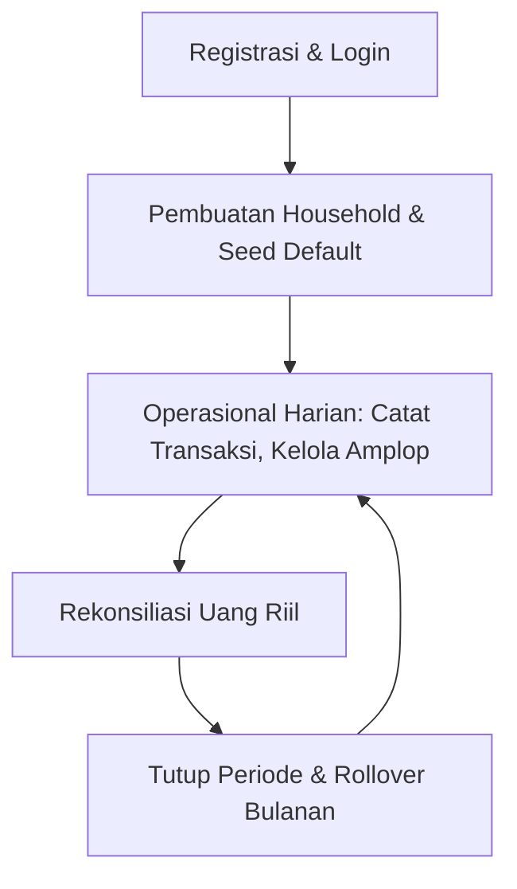
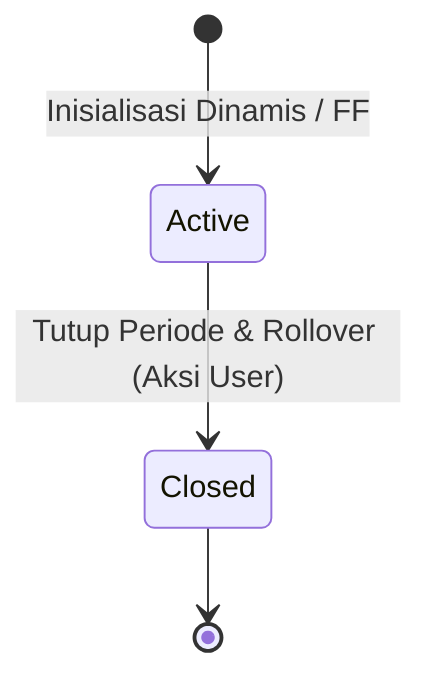
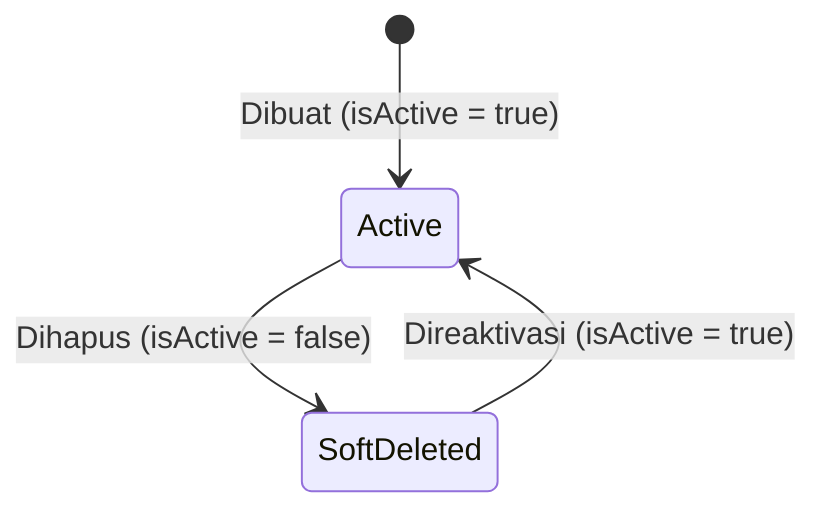

# ⚙️ Dokumentasi Proses Bisnis & Analisis Alur FamiVault

## 📌 Riwayat Versi & Perubahan (Changelog)

- **v1.0.48 (Rilis Saat Ini)**:
  - **Penyempurnaan Antarmuka (UI/UX) Kelola Amplop**:
    - **Visual Squircles & Emojis**: Mengganti titik warna padat standar (16px) dengan kontainer visual premium 44x44px squircles yang menggunakan opacity warna dasar (10%) dan gradasi garis batas yang harmonis (30%), dengan emoji kategori di tengahnya (`getEnvelopeEmoji`) untuk menyelaraskan dengan dashboard utama.
    - **Kartu Mengambang & Hover Interaktif**: Mengubah list layout Framework7 standar menjadi baris kartu berlatar putih dengan border lembut, bayangan halus, dan efek hover transisi scaling interaktif yang membesar pelan dan bergeser ke atas untuk memberikan sensasi taktil modern.
    - **Pill Rollover Berwarna**: Menampilkan perilaku rollover anggaran ("Transfer ke Tabungan", "Menumpuk (Rollover)", "Kembali Nol (Reset)") sebagai label pill berwarna (biru, hijau, abu-abu) dengan kontras teks dan border yang tinggi guna mempermudah pemahaman konfigurasi amplop dalam sekali lirik.
    - **Overlay Target Tabungan**: Menampilkan badge 🏦 kecil secara absolut di pojok kanan bawah squircles untuk menandai amplop target tabungan dengan jelas tanpa merusak estetika antarmuka.
- **v1.0.47**:
  - **Interactive Search & Filters and Premium Card UI**:
    - Menambahkan fitur pencarian real-time dan chip filter scroll horizontal untuk Amplop dan Sumber Transaksi (`📷 Struk`, `📱 Share`, `✍️ Manual`).
    - Menampilkan data riwayat transaksi dalam bentuk kartu mengambang dibatasi header tanggal Indonesia yang terurut menurun.
    - Sinkronisasi ekspor CSV untuk hanya mengunduh data transaksi yang sesuai filter aktif.
- **v1.0.46**:
  - **Perbaikan UI/UX Pengisian Otomatis Split Catatan**:
    - **Pemetaan Teks Catatan Item dari OCR**: Memastikan tombol Auto-Split secara aktif memetakan dan menginisialisasi `note` dengan nama barang belanjaan asli yang diekstrak oleh OCR AI Gemini Vision (`item.name`). Hal ini mencegah input nama barang tetap tersembunyi (karena nilai `undefined`) dan memungkinkan pengguna melihat/mengedit catatan item tersebut langsung di kartu editor ketika mengganti alokasi amplop.
- **v1.0.45**:
  - **Penyempurnaan Split Kategori dengan Rekomendasi Amplop & Catatan per Item dari Struk OCR**:
    - **Ekstraksi Rekomendasi Amplop per Item**: Model OCR AI Gemini Vision kini menganalisis nama barang belanjaan individu pada struk dan merekomendasikan ID amplop terdekat yang paling sesuai (misal: "Minyak Goreng" ke amplop "Makan & Kebersihan", "Bensin" ke "Transportasi & Bensin").
    - **Pencatatan Nama Barang per Item (Split Note)**: Membawa nama barang (e.g. "POP MIE AYAM 75G") sebagai catatan item split (`note` per item). Ini memungkinkan pengguna menyimpan transaksi dengan label spesifik per item belanja alih-alih label generic `Split (1/9)`.
    - **Pembaruan UI Split Editor**: Input dinamis di `SplitItem.vue` dan `SplitEditor.vue` sekarang menampilkan input teks untuk mengedit nama/catatan item secara manual, serta memvisualisasikannya dalam bentuk kartu yang rapi.
    - **Validasi Alokasi & Pengisian Otomatis**: Integrasi penuh di frontend `AddTransaction.vue` untuk memetakan item-item struk langsung ke amplop-amplop rekomendasi yang terdeteksi AI secara cerdas dan mengisi nominal serta catatan item tersebut secara otomatis.
- **v1.0.35**:
  - **Penyelesaian Usability & UX Gaps Lanjutan**:
    - **Batch Share Struk**: Pemrosesan sequential batch untuk unggahan banyak struk sekaligus dengan progress indicator, batas maksimal 5 file (diblokir preventif di sisi klien), deteksi duplikasi intra-batch secara sekuensial, dan mekanisme auto-save/parkir tinjauan demi mencegah penumpukan dialog pop-up.
    - **Normalisasi Nama Merchant**: Pembersihan suffix badan hukum (PT, CV, Tbk, dll.) secara regex dan ekstraksi brand dagang oleh Gemini Vision guna memperkuat validasi transaksi ganda.
    - **Penanganan Amplop Rendah-Confidence**: Visualisasi badge peringatan _"Amplop Belum Yakin"_ dan pembukaan form inline drawer `+ Amplop Baru` langsung dari layar tinjauan OCR tanpa interupsi flow.
    - **Nudge Optimalisasi Anggaran**: Deteksi pola penumpukan anggaran pada amplop "Lain-lain" (>60%) dengan batas filter kebisingan (min. 10 transaksi dan periode aktif 7 hari) disertai rekomendasi taktis pembuatan amplop baru dari deskripsi belanja terpopuler.
    - **Batas Auto-Retry Antrean Aktif**: Transaksi offline yang gagal karena kesalahan validasi bisnis/server akan diulang secara otomatis hingga maksimal 3 kali sebelum dipindahkan ke antrean gagal permanen (_failed queue_) untuk tinjauan pengguna.
    - **Guided Action Rekonsiliasi**: Tombol tindakan instan untuk membukukan selisih negatif secara otomatis sebagai pengeluaran penyesuaian.
- **v1.0.34**:
  - **Penyempurnaan Penanganan Kegagalan Sinkronisasi Offline**:
    - **Offline Failed Sync Queue**: Menyimpan transaksi offline yang gagal disinkronkan akibat validasi bisnis (termasuk kegagalan recovery closed period) ke dalam antrean kegagalan persisten di `localStorage`.
    - **Banner Peringatan Dashboard**: Menampilkan banner peringatan interaktif berwarna merah cerah di dashboard utama (`Home.vue`) saat ada transaksi gagal di antrean.
    - **Sheet Peninjauan Transaksi Gagal**: BottomSheet interaktif Framework7 untuk meninjau detail kesalahan (e.g. saldo minus, periode ditutup, amplop dinonaktifkan) dengan opsi coba lagi (retry) atau hapus (delete).
    - **Bahasa Dialog Ramah Pengguna**: Mengubah dialog peringatan temporal gap di `useTransactionSubmit.ts` menjadi bahasa non-teknis yang mudah dimengerti pengguna awam.
- **v1.0.33**:
  - **Penguatan Definisi Proses Bisnis & Resolusi Gap Dokumentasi**:
    - **Amandemen Lock Policy**: Mendefinisikan pengecualian resmi (_controlled exception_) untuk operasi `forceWriteClosedPeriod` pada periode N-1, termasuk batas kedalaman cascade (1 level) dan syarat jarak waktu (tepat 1 bulan sebelum periode aktif).
    - **Pelebaran Window Duplikasi**: Memperluas jendela pencocokan transaksi ganda dari ±1 jam menjadi ±24 jam berdasarkan `transactionAt` untuk menangkap skenario temporal gap dan share struk lintas pasangan.
    - **Known Limitations**: Mendefinisikan secara eksplisit batasan MVP untuk skenario Split Bill (bayar sebagian dari struk) dan Struk Mata Uang Asing beserta workaround manual yang tersedia.
    - **Komunikasi UX Offline**: Memperjelas strategi komunikasi asimetri antara upload foto (diblokir) vs teks share target (diantrikan) melalui pesan Toast yang terdiversifikasi.
- **v1.0.32**:
  - **Penanganan Unhappy Path OCR & Share Target**:
    - **Solusi Temporal Gap**: Dialog konfirmasi untuk menggeser transaksi ke periode aktif atau menulis paksa ke periode tertutup disertai kalkulasi ulang rollover berantai.
    - **Deteksi Transaksi Ganda**: Pemindaian fuzzy semantik untuk mencegah duplikasi (pencocokan amount, merchant, waktu), dengan opsi dialog "Tetap Simpan" atau "Batalkan".
    - **Visual Confidence & Auto-Focus**: Penerapan badge tingkat akurasi OCR (High/Medium/Low), efek denyut kuning (`pulse-highlight`) pada kolom otomatis, fokus otomatis ke nominal jika akurasi rendah, serta label dinamis "Tinjau & Simpan Transaksi".
    - **Validasi Format & Manual Fallback**: Pembatasan file selain gambar/PDF dan fallback otomatis ke pengisian manual saat terjadi kegagalan proses OCR.
    - **Split Kategori Otomatis**: Deteksi array items pada struk untuk auto-mapping ke mode Split Kategori secara instan lewat banner tautan.
    - **Offline Target Queue**: Validasi luring saat unggah struk foto dan penyimpanan antrean teks share target ke antrean luring di local storage.
- **v1.0.31**:
  - **PWA Offline Sync**:
    - Implementasi antrean transaksi offline di local storage (`localStorage`) agar pengguna tetap bisa mencatat pengeluaran saat offline.
    - Sinkronisasi otomatis ke backend saat koneksi internet pulih.
- **v1.0.30**:
  - **Penyempurnaan Copy Rollover**:
    - Mengubah label teknis agar mudah dipahami: `Urut (Cascade)` -> `Tutup Runtut (Bulan demi Bulan)`, `Lompat Langsung (Fast-Forward)` -> `Lompati Bulan Kosong (Lompat ke Bulan Ini)`.
  - **SSE Attribution & Notifikasi Partner**:
    - Notifikasi Toast interaktif saat menerima event SSE `transaction_changed` atau `envelope_changed` yang berasal dari pasangan dengan pemetaan ID ke nama asli pasangan.
- **v1.0.29**:
  - **Resolusi Over-Budget OCR**:
    - Implementasi Situational Dialog khusus saat penginputan via OCR/Share Target ke amplop yang over-budget dengan 3 opsi: "Catat & Biarkan Minus", "Gunakan Saldo Amplop Lain" (dengan Smart Filtering), dan "Naikkan Anggaran Sekarang" (konfirmasi pra-aksi + auto-raise).
- **v1.0.28**:
  - **Zero-Knowledge UX & Onboarding**:
    - Penambahan teks peringatan over-budgeting berwarna merah pada kartu amplop (`EnvelopeCard.vue`) jika sisa anggaran bernilai negatif.
    - Penambahan badge status "Ditutup" dan banner info edukasi di kartu amplop dinonaktifkan yang memiliki transaksi berjalan.
    - Pembaruan halaman kosong (_empty states_) interaktif dan edukatif di Dashboard Utama (Home), Riwayat Transaksi, Kelola Amplop, dan Rekonsiliasi Keuangan.
- **v1.0.27**:
  - **Refaktorisasi & Pemecahan File Besar**:
    - Dekomposisi stylesheet monolitik `app.css` menjadi modul parsial (`src/css/`).
    - Pemisahan logika form dan submit transaksi pada `useAddTransaction.ts` menjadi sub-composable yang terfokus.
    - Pemecahan halaman besar `Settings.vue` dan `PeriodSummary.vue` menjadi sub-komponen modular terpisah untuk keterbacaan dan pemeliharaan kode yang lebih baik.
- **v1.0.26**:
  - **Proteksi Amplop Nonaktif**:
    - Implementasi penanda visual kartu amplop "Ditutup" di dasbor utama dengan opacity redup dan garis putus-putus.
    - Pemblokiran pencatatan transaksi baru pada amplop nonaktif lewat klik dasbor utama disertai dialog edukasi.
    - Filter dinamis dropdown kategori transaksi agar hanya menampilkan amplop aktif.
- **v1.0.25**:
  - Penambahan parameter bypass `forceDeleteTransactions` pada `/auth/join-household` untuk mempermudah pembersihan data lama pengguna secara sadar.
  - Implementasi konfirmasi visual pra-aksi (pre-action confirmation) saat melakukan perubahan batas anggaran default (Scenario B).
  - Penambahan flag `keptInActivePeriod` pada CRUD amplop untuk mendukung soft-delete amplop yang memiliki riwayat transaksi (Scenario C).
  - **Pembersihan Rumah Tangga Kosong**: Rumah tangga lama otomatis dihapus dari database jika ditinggalkan oleh anggota terakhirnya guna mencegah terjadinya data yatim/ghost households.
- **v1.0.22**:
  - Penambahan fitur pratinjau rollover (rollover preview) pada UI pengaturan.
- **v1.0.21**:
  - Penambahan tabel `rollover_logs` untuk mencatat riwayat perpindahan dana secara auditabel.

---

Dokumen ini memetakan seluruh proses bisnis aplikasi FamiVault dari onboarding pertama kali, aktivitas harian, hingga penutupan siklus bulanan (rollover). Dokumen ini juga menganalisis skenario **Happy Path** (kondisi ideal) dan **Unhappy Path** (kondisi anomali/eror) untuk memastikan perilaku (_behavior_) sistem tetap logis, aman, dan konsisten bagi pengguna.

---

## 🔄 1. Peta Siklus Pengguna (User Lifecycle)

Siklus hidup data dan aktivitas pengguna di FamiVault dibagi menjadi 4 fase utama yang saling terhubung:



### Fase A: Onboarding & Login Pertama Kali

1. **Otentikasi**: Pengguna masuk via Google Sign-In (Native Credential Manager pada Android, atau Web OAuth pada browser).
2. **Identifikasi Rumah Tangga (_Household_)**:
   - Jika pengguna baru mendaftar, backend secara otomatis membuat entri `household` baru dan menetapkan pengguna tersebut sebagai `Owner`.
   - Jika pengguna mendaftar melalui kode undangan pasangan, mereka langsung bergabung ke `household` yang sudah ada sebagai `Anggota`.
3. **Inisialisasi Data Awal (Seeding & Self-Healing)**:
   - Jika pengguna baru membuat `household` baru, sistem memicu pembuatan template amplop default (e.g. Belanja Mingguan, Uang Kos, Tabungan) dan periode anggaran aktif untuk bulan & tahun berjalan saat ini.

### Fase B: Aktivitas Harian & Transaksi

1. Pengguna memasukkan transaksi pengeluaran melalui 3 metode:
   - **Input Manual**: Mengisi form nama transaksi, nominal, dan memilih kategori amplop.
   - **Gemini Vision AI (OCR)**: Mengambil/mengunggah foto struk belanja. Gemini mengekstrak total nominal, merchant, tanggal, serta menyarankan klasifikasi amplop yang sesuai.
   - **Android Share Target**: Membagikan tangkapan layar/pdf struk m-banking langsung dari galeri HP ke PWA FamiVault untuk diekstrak otomatis.
2. Setiap transaksi yang tersimpan akan memotong sisa saldo alokasi berjalan amplop tersebut.
3. Perubahan saldo dan penambahan transaksi **disiarkan secara instan** via Server-Sent Events (SSE) ke perangkat pasangan yang terhubung dalam satu household.

### Fase C: Rekonsiliasi Mingguan

1. Pengguna memasukkan total uang fisik & digital riil mereka (Bank + Dompet Digital + Uang Tunai).
2. Aplikasi menghitung varians (selisih): `Selisih = Uang Riil - Total Sisa Saldo Amplop`.
3. Jika selisih bernilai negatif, berarti ada pengeluaran yang lupa dicatat. Jika positif, terdapat kesalahan pencatatan saldo awal atau penerimaan dana yang belum dialokasikan.
4. **Guided Action Rekonsiliasi**: Jika terdapat selisih (terutama negatif), aplikasi menyajikan tombol aksi terpandu:
   - **"Catat Selisih sebagai Pengeluaran"**: Secara otomatis mencatatkan transaksi penyesuaian sebesar nilai selisih pada amplop "Lain-lain" atau amplop pilihan guna menyelaraskan neraca seketika.
   - **"Tinjau Catatan"**: Pintasan untuk menavigasikan pengguna ke riwayat transaksi minggu ini agar dapat melacak pengeluaran yang terlewat secara manual.

### Fase D: Rollover & Looping Bulanan

1. Di akhir bulan, pengguna mengeklik **"Tutup Periode"** pada menu Pengaturan.
2. Aplikasi memunculkan **Pratinjau Rollover & Smart Insights Sheet** yang mengkalkulasi total dana tersisa secara real-time, dana yang akan otomatis dipindahkan ke Tabungan, dana yang akan tetap di amplop, serta memperingatkan jika ada sisa dana yang akan hangus/di-reset ke nol.
3. Setelah dikonfirmasi, sistem mengevaluasi sisa saldo pada masing-masing amplop berdasarkan perilaku rollover masing-masing:
   - **Reset**: Sisa saldo dihanguskan (kembali ke `0.00`).
   - **Rollover**: Sisa saldo diakumulasikan ke bulan berikutnya sebagai dana tambahan.
   - **Transfer ke Tabungan**: Sisa saldo dipindahkan ke amplop khusus kategori Tabungan/Investasi (jika template amplop "Tabungan" tidak aktif atau tidak ditemukan, sistem otomatis memulihkan/membuat ulang template tersebut agar dana sisa tidak hilang secara diam-diam).
4. Sistem mencatat seluruh histori pemindahan sisa dana ini ke tabel audit `rollover_logs` untuk dianalisis oleh pengguna pada menu analisis anggaran.
5. Sistem membuka periode baru dan menyalin template amplop aktif beserta sisa saldo rollover yang dihitung.

---

## 🔍 2. Analisis Happy Path & Unhappy Path

Untuk menjaga konsistensi database dan kejelasan UX, berikut adalah analisis skenario operasional beserta perilakunya:

### 📑 A. Skenario Bergabung ke Rumah Tangga Pasangan

Skenario saat pengguna memutuskan bergabung ke rumah tangga pasangan lewat kode undangan.

| Alur                               | Deskripsi Perilaku Sistem                                                                                                                                                                                                                                         | Evaluasi UX & Konsistensi                                                                                                                                                                                                                                                                                                                                                                                                                                                                                                                         |
| :--------------------------------- | :---------------------------------------------------------------------------------------------------------------------------------------------------------------------------------------------------------------------------------------------------------------- | :------------------------------------------------------------------------------------------------------------------------------------------------------------------------------------------------------------------------------------------------------------------------------------------------------------------------------------------------------------------------------------------------------------------------------------------------------------------------------------------------------------------------------------------------ |
| **Happy Path**                     | Pengguna memasukkan kode undangan pasangan $\rightarrow$ Household mereka diubah ke ID pasangan $\rightarrow$ Halaman Home langsung memuat ulang daftar amplop dan periode berjalan pasangan $\rightarrow$ Status bar berubah menjadi "Alokasi Saling Terhubung". | Pengguna langsung melihat data keuangan yang sama secara real-time tanpa perlu me-restart aplikasi.                                                                                                                                                                                                                                                                                                                                                                                                                                               |
| **Unhappy Path (Data Orphaned)**   | Pengguna sempat membuat transaksi di household-nya sendiri sebelum bergabung ke household pasangan $\rightarrow$ Transaksi lama tersebut tertinggal di database dengan household lama yang ditinggalkan.                                                          | **Solusi (Terimplementasi v1.0.25)**: Backend secara ketat menolak permintaan penggabungan rumah tangga (`POST /join-household`) jika pengguna memiliki data transaksi tercatat (mengembalikan status `400 Bad Request` dengan kode `HOUSEHOLD_JOIN_BLOCKED_EXISTING_DATA`). Pengguna dapat mengabaikan blokir ini dengan menyetujui opsi hapus transaksi (`forceDeleteTransactions: true`) pada dialog konfirmasi UI, yang akan membersihkan seluruh catatan transaksi lama pengguna sebelum menggabungkan mereka ke household baru secara aman. |
| **Unhappy Path (Periode Berbeda)** | Pasangan memiliki periode aktif berjalan (misal: Juni 2026), namun pengguna baru baru login pertama kali.                                                                                                                                                         | **Solusi (_Self-Healing_)**: Saat pengguna baru membuka halaman Home, sistem secara otomatis mengecek apakah ada amplop aktif pasangan yang belum teralokasikan untuk pengguna baru ini. Fungsi self-healing di endpoint `GET /periods/:id` otomatis membuat alokasi yang hilang secara transparan.                                                                                                                                                                                                                                               |

---

### 📑 B. Skenario Pengeditan Nominal Anggaran Amplop

Skenario ketika pengguna mengedit nilai anggaran bulanan default di menu "Kelola Amplop".

| Alur                                | Deskripsi Perilaku Sistem                                                                                                                                                                                                                                                                                        | Evaluasi UX & Konsistensi                                                                                                                                                                                                                                                                                                                                                                                                                                             |
| :---------------------------------- | :--------------------------------------------------------------------------------------------------------------------------------------------------------------------------------------------------------------------------------------------------------------------------------------------------------------- | :-------------------------------------------------------------------------------------------------------------------------------------------------------------------------------------------------------------------------------------------------------------------------------------------------------------------------------------------------------------------------------------------------------------------------------------------------------------------- |
| **Happy Path**                      | Pengguna mengedit nominal default amplop dari Rp 500.000 menjadi Rp 750.000 $\rightarrow$ Nilai default di template ter-update $\rightarrow$ Alokasi periode aktif berjalan otomatis ikut berubah menjadi Rp 750.000 $\rightarrow$ Halaman Home langsung memperbarui nilai target dan sisa saldo amplop terkait. | Perubahan langsung dirasakan di bulan berjalan. Pengguna tidak perlu menunggu hingga rollover bulan depan hanya untuk mengoreksi batas anggaran bulan ini.                                                                                                                                                                                                                                                                                                            |
| **Unhappy Path (Over-budgeting)**   | Pengguna menurunkan nominal anggaran default (misal dari Rp 500.000 menjadi Rp 200.000), padahal mereka **sudah membelanjakan Rp 300.000** di bulan berjalan ini.                                                                                                                                                | **Solusi (Terimplementasi v1.0.25)**: Sistem tetap mengizinkan pembaruan alokasi berjalan di database, namun UI menampilkan sisa saldo amplop tersebut sebagai **negatif** (e.g. `Sisa: -Rp 100.000`) dengan indikator warna merah cerah. Sebelum perubahan disimpan, UI memicu dialog konfirmasi pra-aksi yang membandingkan nominal anggaran lama vs baru secara visual dan memperingatkan pengguna mengenai dampak retroaktif pada alokasi periode aktif berjalan. |
| **Unhappy Path (Periode Tertutup)** | Pengguna mengharapkan perubahan nominal ini juga mengubah catatan bulan-bulan sebelumnya yang sudah ditutup untuk merapikan laporan masa lalu.                                                                                                                                                                   | **Solusi**: Sistem **membatasi perubahan alokasi secara ketat** hanya pada periode berjalan yang berstatus aktif (`isClosed: false`). Data periode masa lalu (`isClosed: true`) dibekukan untuk menjaga integritas data historis demi keakuratan laporan laporan tahunan.                                                                                                                                                                                             |

---

### 📑 C. Skenario Penghapusan Amplop (Soft Delete)

Skenario saat pengguna menghapus amplop di menu "Kelola Amplop".

| Alur                                       | Deskripsi Perilaku Sistem                                                                                                                                                                                                                                                                                                                   | Evaluasi UX & Konsistensi                                                                                                                                                                                                                                                                                                                                                                                                                         |
| :----------------------------------------- | :------------------------------------------------------------------------------------------------------------------------------------------------------------------------------------------------------------------------------------------------------------------------------------------------------------------------------------------ | :------------------------------------------------------------------------------------------------------------------------------------------------------------------------------------------------------------------------------------------------------------------------------------------------------------------------------------------------------------------------------------------------------------------------------------------------ |
| **Happy Path (Belum Ada Transaksi)**       | Pengguna menghapus amplop $\rightarrow$ Template amplop diubah menjadi `isActive: false` $\rightarrow$ Sistem memeriksa alokasi periode aktif berjalan $\rightarrow$ Karena belum ada transaksi terkait, baris alokasi di database **ikut dihapus secara permanen** $\rightarrow$ Amplop langsung hilang dari Home.                         | Halaman Home langsung bersih dari amplop yang batal digunakan tanpa meninggalkan sampah relasi data (_clean clean-up_).                                                                                                                                                                                                                                                                                                                           |
| **Happy Path (Sudah Ada Transaksi)**       | Pengguna menghapus amplop $\rightarrow$ Template diubah menjadi `isActive: false` $\rightarrow$ Sistem memeriksa alokasi periode aktif $\rightarrow$ Karena **sudah ada transaksi**, baris alokasi tetap dipertahankan $\rightarrow$ Halaman Home tetap menampilkan amplop tersebut untuk periode berjalan agar neraca balance tetap valid. | **Solusi (Terimplementasi v1.0.25)**: Data historis transaksi tetap aman. Backend mengembalikan parameter `keptInActivePeriod: true` saat menonaktifkan amplop dengan transaksi aktif. UI menangkap respons ini untuk memicu pemberitahuan edukatif bahwa amplop dinonaktifkan dari template master, namun akan tetap ditampilkan sebagai amplop "Ditutup" di dashboard utama hingga periode berakhir demi akurasi pencatatan neraca bulanan.     |
| **Unhappy Path (Kategori Transaksi Baru)** | Setelah amplop dinonaktifkan (`isActive: false`), pengguna mencoba mencatat transaksi baru pada amplop tersebut.                                                                                                                                                                                                                            | **Solusi (Terimplementasi v1.0.26)**: Dropdown pilihan kategori pada formulir "Tambah Transaksi" secara aktif menyaring dan **hanya menampilkan amplop yang berstatus `isActive: true`**. Selain itu, jika pengguna mencoba mengeklik kartu amplop nonaktif ("Ditutup") di dasbor utama untuk menambahkan transaksi secara langsung, UI memblokir tindakan ini dan memunculkan dialog edukasi/peringatan yang menjelaskan status amplop tersebut. |

---

### 📑 D. Skenario Keterlambatan Login / Periode Kosong

Skenario ketika pengguna tidak membuka aplikasi selama beberapa bulan, kemudian kembali masuk.

| Alur                                                     | Deskripsi Perilaku Sistem                                                                                                                                                                                                                                                               | Evaluasi UX & Konsistensi                                                                                                                                                                                                                                                                                 |
| :------------------------------------------------------- | :-------------------------------------------------------------------------------------------------------------------------------------------------------------------------------------------------------------------------------------------------------------------------------------- | :-------------------------------------------------------------------------------------------------------------------------------------------------------------------------------------------------------------------------------------------------------------------------------------------------------- |
| **Happy Path**                                           | Pengguna membuka aplikasi $\rightarrow$ Sistem mendeteksi periode aktif terakhir berada di masa lalu dan **memiliki catatan transaksi** $\rightarrow$ Aplikasi menyarankan pengguna untuk menutup periode secara beruntun (_cascade rollover_) hingga mencapai bulan berjalan saat ini. | Saldo rollover terhitung secara runtut dan masuk akal, menjaga keakuratan sisa uang yang terakumulasi.                                                                                                                                                                                                    |
| **Unhappy Path (Fast-Forward)**                          | Pengguna baru login pertama kali $\rightarrow$ Database awal terisi seed lama (Juni 2025) dengan **jumlah transaksi = 0** $\rightarrow$ Pengguna bingung mengapa tanggal anggaran mereka berada di masa lalu.                                                                           | **Solusi**: Sistem secara otomatis mendeteksi jika hanya ada 1 periode lama dengan transaksi 0, lalu melakukan _fast-forward_ (memperbarui bulan & tahun periode tersebut ke tanggal hari ini secara langsung di database). Pengguna langsung masuk ke periode aktif saat ini secara instan.              |
| **Unhappy Path (Bulan Terlewat Banyak Tanpa Transaksi)** | Pengguna tidak aktif selama 3 mana terakhir aktif Maret, sekarang Juni) dan tidak ada transaksi sama sekali di April dan Mei.                                                                                                                                                           | **Solusi**: Ketika rollover dijalankan dari Maret, sistem mendeteksi kelompangan tersebut. Pengguna diberikan opsi apakah ingin membuat periode kosong beruntun (untuk mencatat riwayat tertunda) atau langsung melompat ke Juni dengan saldo sisa Maret dipindahkan secara utuh sebagai saldo awal Juni. |

---

## 🏛️ 3. Resolusi Celah Logika & Spesifikasi Teknis (BPA Resolution)

Untuk menjamin tidak adanya asumsi implisit yang berbeda antar pengembang, berikut adalah spesifikasi teknis dan aturan logika bisnis yang telah didefinisikan secara eksplisit:

### A. State Machine Entitas

#### 1. Siklus Hidup `budgetPeriods`



- **Reopening**: Periode yang sudah berstatus `isClosed: true` **tidak dapat dibuka kembali** oleh pengguna maupun admin. Aturan ini mutlak untuk mencegah rusaknya rantai perhitungan saldo rollover pada periode-periode berikutnya.
- **Lock Policy**: Seluruh transaksi yang terikat pada periode yang sudah ditutup bersifat _read-only_ (tidak bisa ditambah, diedit, atau dihapus).
  - _Catatan Keamanan/Desain_: Lock ini ditegakkan di layer aplikasi/middleware service API untuk menyederhanakan skema DB dan menghindari overhead database triggers. Relasi `onDelete: "cascade"` pada database diatur untuk pembersihan menyeluruh jika rumah tangga/household dibubarkan, namun selama siklus normal, API mencegah segala bentuk mutasi pada periode tertutup.
  - **Pengecualian Terdokumentasi — `forceWriteClosedPeriod` (Terimplementasi v1.0.32)**:
    Lock Policy memiliki satu pengecualian terkontrol (_controlled exception_) untuk skenario OCR/Share Target temporal gap, dengan syarat dan batasan ketat sebagai berikut:
    1. **Syarat Jarak Waktu**: Penulisan paksa **hanya diizinkan** pada periode tertutup yang berjarak **tepat 1 bulan kalender** sebelum periode aktif berjalan (periode N-1). Permintaan penulisan ke periode yang lebih tua dari N-1 ditolak oleh backend dengan error `PERIOD_CLOSED_TOO_FAR`.
    2. **Batas Kedalaman Cascade**: Setelah transaksi disisipkan ke periode N-1, sistem menjalankan `recalculateRolloverForHousehold()` yang memperbarui `rolloverAmount` pada seluruh alokasi di periode N (aktif). Karena N-1 adalah satu-satunya periode yang diizinkan, cascade secara inheren dibatasi ke **1 level** — hanya rollover dari N-1 → N yang dihitung ulang.
    3. **Integritas Transaksi Periode N**: Transaksi yang sudah tercatat di periode N **tidak ter-invalidate** oleh recalculation ini. Yang berubah hanyalah nilai `rolloverAmount` pada alokasi periode N, sehingga sisa saldo (`allocatedAmount + rolloverAmount - spent`) ikut bergeser secara otomatis.
    4. **Notifikasi Pasangan**: Setelah recalculation selesai, server menyiarkan event SSE `envelope_changed` ke perangkat pasangan agar dashboard mereka me-refresh saldo terbaru yang sudah disesuaikan.
    5. **Filosofi Desain**: Pengecualian ini bukan pelanggaran Lock Policy, melainkan _trade-off_ yang disengaja untuk menjaga akurasi rekap bulanan. Alternatifnya — memaksa semua struk tertanggal lalu masuk ke periode aktif — justru merusak keakuratan laporan periode aktif dengan memasukkan pengeluaran yang secara semantik bukan milik bulan tersebut.

#### 2. Siklus Hidup `envelopeTemplates`



- **Soft-Delete**: Penghapusan amplop mengubah status `isActive` menjadi `false` (tidak menghapus baris dari DB agar riwayat pengeluaran masa lalu tidak rusak).
- **Reaktivasi**: Pengguna dapat mengaktifkan kembali amplop yang telah di-soft-delete dengan nama yang sama.
- **Pemicu Mid-Period**: Jika template amplop diaktifkan kembali di tengah periode berjalan, sistem melalui mekanisme **Self-Healing** pada endpoint detail periode (`GET /periods/:id`) secara otomatis mendeteksi hilangnya relasi alokasi untuk periode aktif ini dan langsung membuatkan entri alokasi baru dengan nominal bawaan (`allocatedAmount = defaultAmount`) dan rollover `0`.

---

### B. Matriks Hak Akses Pengguna (Actor-Permission Matrix)

FamiVault dirancang dengan model **Kemitraan Keuangan Setara** (_Equal Financial Partnership_) untuk menghindari ketimpangan kontrol finansial antar pasangan. Namun, terdapat batasan administratif tertentu:

| Aksi / Fitur                          | Owner (Pembuat Rumah Tangga) | Member (Pasangan Bergabung) | Keterangan Logika Bisnis                                                     |
| :------------------------------------ | :--------------------------: | :-------------------------: | :--------------------------------------------------------------------------- |
| Mencatat/Mengedit/Menghapus Transaksi |              ✅              |             ✅              | Keduanya memiliki hak setara untuk mencatat pengeluaran harian.              |
| Membuat/Mengedit/Menghapus Amplop     |              ✅              |             ✅              | Keduanya dapat mengelola template anggaran rumah tangga bersama.             |
| Menutup Periode (Rollover)            |              ✅              |             ✅              | Siapa pun yang berdiskusi di akhir bulan dapat memicu transisi periode baru. |
| Melihat Laporan & Log Rollover        |              ✅              |             ✅              | Keduanya memiliki akses penuh ke histori transparansi keuangan.              |
| Melihat Kode Undangan Rumah Tangga    |              ✅              |             ✅              | Kode undangan dapat dibagikan oleh siapa saja untuk menghubungkan akun.      |
| Mengeluarkan Pasangan (_Kick Member_) |              ✅              |             ❌              | Hanya pembuat rumah tangga asli yang dapat memutuskan hubungan kemitraan.    |
| Membubarkan Rumah Tangga              |              ✅              |             ❌              | Hanya Owner yang dapat menghapus/membubarkan entitas rumah tangga di sistem. |

---

### C. Tabel Keputusan (Decision Table) Penyelarasan Periode

Saat pengguna login atau memicu rollover, sistem mengevaluasi status periode terakhir menggunakan logika berikut:

| Kondisi Periode Terakhir                          | Jumlah Transaksi | Selisih Waktu dengan Hari Ini | Aksi Sistem                                                                                                                                                   |
| :------------------------------------------------ | :--------------: | :---------------------------: | :------------------------------------------------------------------------------------------------------------------------------------------------------------ |
| Belum ada periode anggaran sama sekali            |        0         |               -               | **Onboarding Seeding**: Buat periode anggaran aktif untuk bulan berjalan saat ini beserta amplop default.                                                     |
| Ada 1 periode aktif di masa lalu (seeding bawaan) |        0         |           > 1 Bulan           | **Fast-Forward In-Place**: Perbarui bulan & tahun periode aktif tersebut ke bulan berjalan saat ini secara langsung di DB.                                    |
| Periode aktif terakhir berada di masa lalu        |       > 0        |           = 1 Bulan           | **Normal Rollover**: Tampilkan pratinjau rollover, tutup periode lama, dan buka periode baru untuk bulan berjalan.                                            |
| Periode aktif terakhir berada di masa lalu        |       > 0        |           > 1 Bulan           | **Cascade Rollover**: Tawarkan pembuatan periode kosong beruntun (untuk mencatat riwayat tertunda) atau langsung melompat ke periode bulan berjalan saat ini. |

- **Detail Fast-Forward In-Place**: Jika pengguna tidak aktif dalam waktu lama namun di database hanya terbentuk tepat 1 periode anggaran (misal periode seeding awal saat registrasi) dan belum memiliki transaksi sama sekali (`transactions = 0`), sistem akan terus menggeser bulan & tahun periode tersebut agar selalu selaras dengan waktu login terkini pengguna. Hal ini mencegah terciptanya periode-periode kosong tak terpakai sejak awal pendaftaran.
- **Batas Cascade Rollover (Threshold Limit)**: Untuk mencegah overload database dan potensi timeout jika pengguna tidak aktif sangat lama (misal > 6 bulan), sistem menetapkan batas toleransi **maksimal 6 bulan cascade**. Jika selisih waktu terlewat melebihi 6 bulan, sistem secara otomatis memaksa rollover langsung lompat (_fast-forward_) ke bulan berjalan dengan memindahkan akumulasi saldo akhir periode aktif terakhir secara utuh.

---

### D. Data Handoff Contract (Skema Kontrak API & SSE)

#### 1. Payload Server-Sent Events (SSE)

Setiap kali ada perubahan data (transaksi baru, edit anggaran, hapus amplop), server menyiarkan payload JSON berikut via stream SSE ke perangkat pasangan:

```json
{
  "event": "budget_update",
  "data": {
    "type": "TRANSACTION_CREATED | ENVELOPE_UPDATED | PERIOD_CLOSED",
    "timestamp": "2026-06-06T08:24:00Z",
    "payload": {
      "envelopeId": "uuid-string",
      "allocatedAmount": 500000,
      "spent": 120000
    }
  }
}
```

- **Pemetaan ID (`envelopeId`)**: Parameter `envelopeId` yang dikirimkan di dalam payload SSE merujuk secara langsung pada kolom primary key `envelope_templates.id` (bukan ID baris alokasi periodik). Hal ini menjamin frontend dapat mencocokkan amplop dan meng-invalidate cache visual dashboard dengan konsisten tanpa adanya mismatch data.

#### 2. Kontrak Error `400 Bad Request` pada `/join-household`

Untuk mencegah transaksi lama ter-orphan ketika pengguna berpindah household, backend mengembalikan kontrak error terstruktur:

```json
{
  "success": false,
  "code": "HOUSEHOLD_JOIN_BLOCKED_EXISTING_DATA",
  "message": "Tidak dapat bergabung ke rumah tangga baru karena Anda sudah memiliki catatan transaksi pada rumah tangga saat ini.",
  "details": {
    "existingTransactionsCount": 14
  }
}
```

Jika pengguna menyetujui peringatan penghapusan transaksi pada dialog konfirmasi di sisi klien, klien akan mengirimkan permintaan bypass dengan payload JSON berikut:

```json
{
  "inviteCode": "INVITE_CODE_HERE",
  "forceDeleteTransactions": true
}
```

Saat server menerima parameter `forceDeleteTransactions: true`, seluruh transaksi lama yang dibuat oleh pengguna tersebut akan dibersihkan sebelum ia dipindahkan ke rumah tangga baru.

---

### E. Klarifikasi Logika Over-Budgeting

Sesuai implementasi pada versi **v1.0.18**:

- **Perubahan Database**: Ketika pengguna menurunkan batas nominal default amplop di tengah bulan (misal dari Rp 500.000 menjadi Rp 200.000), sistem **secara langsung mengubah nilai `allocatedAmount`** di database pada tabel `budget_allocations` untuk periode aktif saat itu juga.
- **Perhitungan di UI**: Nilai saldo sisa dihitung secara dinamis melalui formula:
  $$\text{Sisa Saldo} = \text{allocatedAmount} + \text{rolloverAmount} - \text{spent}$$
- Jika nilai sisa saldo bernilai negatif (misal Rp 200.000 + Rp 0 - Rp 300.000 = -Rp 100.000), UI secara reaktif akan mengubah warna saldo menjadi merah marun (`var(--fintr-danger)`) sebagai alarm visual tanpa memblokir transaksi yang sudah terjadi.

---

### F. Rekonsiliasi Keuangan (Reconciliation Logic)

- **Formula Selisih Rekonsiliasi**:
  $$\text{Selisih Varians} = \text{Uang Riil} - \sum (\text{allocatedAmount} + \text{rolloverAmount} - \text{spent})$$
- **Kepemilikan Saldo**: `accountSnapshots` disimpan per **Household** (`householdId`) untuk menggambarkan total likuiditas bersama. Catatan ini merekam kontribusi saldo riil dari masing-masing rekening pasangan (Bank A + Bank B + Dompet Tunai) yang diinput saat sesi rekonsiliasi bersama di akhir pekan.
- **Penyimpanan Varians**: Selisih varians tidak disimpan dalam kolom terpisah secara redundan, melainkan dihitung secara dinamis di level API saat membandingkan saldo riil terakhir pada `accountSnapshots` dengan akumulasi sisa saldo aktif amplop.

---

## 🛠️ 4. Rekomendasi Pengembangan Masa Depan

Berdasarkan analisis Happy & Unhappy Path di atas, berikut adalah beberapa perbaikan operasional yang direkomendasikan untuk pengembangan jangka panjang:

1. **Validasi Sebelum Gabung Rumah Tangga (Terimplementasi v1.0.19)**: Validasi filter backend telah diterapkan pada endpoint `/join-household` untuk memblokir aksi penggabungan apabila terdapat catatan transaksi pada household lama guna melindungi integritas data.
2. **Keamanan Saldo Rollover saat Amplop "Tabungan" Hilang (Terimplementasi v1.0.20)**: Apabila terdapat alokasi dengan behavior `rollover_to_savings` namun template amplop `"Tabungan"` telah dihapus/dinonaktifkan oleh pengguna, sistem secara otomatis akan memulihkan atau membuat ulang template `"Tabungan"` baru di akhir periode agar sisa saldo tidak hilang secara diam-diam.
3. **Riwayat Rollover Terpusat & Log Audit UI (Terimplementasi v1.0.21)**: Menyimpan log khusus rollover yang mencatat berapa sisa dana yang di-reset, di-rollover, atau ditransfer ke tabungan di setiap akhir bulan sebagai bahan laporan audit tahunan pengguna, serta menyajikannya dalam tab Log Rollover di analisis anggaran.
4. **Pratinjau Rollover & Smart Insights UI (Terimplementasi v1.0.22)**: Menghadirkan bottom sheet pratinjau rollover interaktif saat pengguna menekan tombol Tutup Periode. Fitur ini menyajikan visualisasi rincian nasib sisa anggaran tiap amplop, total dana yang akan ditabung/dipertahankan, serta alarm peringatan dinamis jika ada sisa anggaran yang akan terbuang sia-sia akibat perilaku reset ke nol.
5. **Mekanisme Sinkronisasi Offline (Terimplementasi v1.0.31)**: Menambahkan antrean transaksi di local storage (`localStorage`) di sisi client PWA agar pengguna tetap bisa mencatat pengeluaran saat tidak ada sinyal internet, dan otomatis melakukan sinkronisasi (_sync back_) saat koneksi terdeteksi kembali.

---

## 🎨 5. Desain UX untuk Pengguna Zero-Knowledge & Onboarding Journey

Untuk memastikan aplikasi dapat digunakan dengan mudah oleh pengguna baru yang belum memiliki mental model keuangan keluarga (_zero-knowledge users_), berikut adalah pedoman UX dan desain interaksi yang diintegrasikan ke dalam FamiVault:

### A. Alur Onboarding & Aha Moment

1. **User Journey yang Ideal**:
   - **Langkah 1**: Registrasi instan (tanpa dipaksa menghubungkan pasangan di awal).
   - **Langkah 2**: Masuk ke dasbor utama yang sudah terisi dengan template amplop default (mencegah _cold start_ / kekosongan data).
   - **Langkah 3**: Mencatat transaksi pengeluaran pertama (baik manual maupun via Vision AI).
   - **Langkah 4 (Aha Moment)**: Pengguna mengundang pasangan $\rightarrow$ pasangan bergabung $\rightarrow$ transaksi yang dicatat langsung muncul di layar pasangan secara real-time via SSE.
2. **Prinsip "Pasangan sebagai Fitur", Bukan Kendala**:
   - Aplikasi dirancang agar tetap 100% berguna bagi pengguna yang menggunakannya secara solo. Fitur penghubung pasangan diletakkan sebagai _enhancement_ (CTA sekunder yang halus di pengaturan/dasbor), bukan sebagai syarat wajib sebelum masuk ke aplikasi (_blocking gate_).

### B. Penyajian Fitur Bertahap (Progressive Disclosure)

Fitur-fitur disajikan secara bertahap sesuai tingkat kedewasaan penggunaan aplikasi untuk mengurangi beban kognitif:

- **Hari 1-7**: Fokus pada pencatatan harian sederhana dan pemantauan sisa saldo amplop. Halaman rekonsiliasi atau tombol tutup periode tidak disorot secara menonjol.
- **Akhir Bulan**: Tombol "Tutup Periode" mulai diaktifkan secara kontekstual di dasbor untuk mengundang pengguna ke tahap _rollover_ dan laporan keuangan bulanan.

### C. Antarmuka Mandiri & Penjelasan Kontekstual (Self-Narrating UI)

Setiap indikasi data yang tidak familiar harus menjelaskan dirinya sendiri secara langsung (inline) di layar aplikasi:

- **Indikator Over-Budgeting (Terimplementasi v1.0.28)**: Saat saldo amplop bernilai negatif, label saldo berubah menjadi warna merah cerah (`var(--fintr-danger)`) disertai teks penjelasan ringkas: _"Anggaran bulan ini lebih kecil dari belanjaan berjalan"_.
- **Visualisasi Amplop Dinonaktifkan ("Ditutup") (Terimplementasi v1.0.28)**: Amplop yang berstatus nonaktif di master namun memiliki transaksi berjalan dirender dengan opacity `0.85`, border putus-putus abu-abu, dan badge kuning/orange _"Amplop Ditutup. Pengeluaran bulan ini tetap tercatat, namun amplop tidak akan muncul di bulan depan."_
- **Empty States yang Edukatif (Terimplementasi v1.0.28)**: Halaman kosong (seperti transaksi baru, riwayat rekonsiliasi, dll.) tidak hanya bertuliskan _"Belum ada data"_, melainkan menyajikan ilustrasi ringan, manfaat fitur tersebut, serta tombol aksi cepat untuk mendorong interaksi pertama.

### D. Skenario Pencatatan Transaksi via OCR/Share Receipt dengan Amplop Over-Budget (Terimplementasi v1.0.29)

Untuk transaksi yang berasal dari OCR atau fitur Share Target (di mana pembayaran sudah terjadi di dunia nyata, misal via QRIS/BRImo), sistem memproses kondisi anggaran sebagai berikut:

#### 1. Matriks Keputusan Sumber Transaksi vs Kondisi Anggaran

| Sumber Transaksi       | Kondisi Saldo Amplop        | Perilaku Sistem                                                                                                                           |
| :--------------------- | :-------------------------- | :---------------------------------------------------------------------------------------------------------------------------------------- |
| **Manual**             | Saldo Cukup                 | Form normal tanpa peringatan.                                                                                                             |
| **Manual**             | Saldo Habis / Over-Budget   | Form normal + **Inline Warning Alert** di bawah dropdown amplop terpilih. Pengguna tetap dapat menyimpan langsung tanpa dialog pemblokir. |
| **OCR / Share Target** | Saldo Cukup                 | Data terisi otomatis (pre-fill) sesuai pembacaan AI Gemini. Simpan langsung secara normal.                                                |
| **OCR / Share Target** | Saldo Habis / Over-Budget   | Menampilkan **Situational Dialog** khusus saat tombol simpan ditekan. Pengguna harus memilih salah satu dari 3 opsi penyelesaian.         |
| **OCR / Share Target** | Amplop Rekomendasi Nonaktif | Mengalihkan pilihan secara otomatis ke amplop aktif pertama dan memicu penjelasan inline di area rekomendasi AI.                          |

#### 2. Spesifikasi Situational Dialog (Resolusi Over-Budget OCR)

Ketika terdeteksi nominal struk > sisa saldo amplop pada transaksi bersumber OCR, dialog Framework7 akan muncul dengan opsi:

- **Catat & Biarkan Minus**: Menyimpan transaksi secara normal. Saldo amplop bersangkutan akan bernilai negatif (`remaining < 0`).
- **Gunakan Saldo Amplop Lain**: Menutup dialog dan mengaktifkan penyaringan cerdas (Smart Filtering) pada form sehingga hanya menampilkan kategori amplop yang saldo berjalannya mencukupi nominal transaksi (`remaining >= nominal_transaksi`). Pengguna diberikan petunjuk visual (inline text) dan opsi "Tampilkan Semua" untuk mematikan filter secara manual jika diperlukan.

### E. Nudge & Edukasi Pola Penggunaan Anggaran (Pencegahan Overuse Amplop Umum)

Untuk mencegah pengguna menyiasati sistem anggaran dengan mengalokasikan seluruh pengeluaran ke satu amplop umum (seperti amplop "Lain-lain" atau "Miscellaneous"), sistem menyediakan nudge/intervensi edukatif dengan aturan filter kebisingan:

1. **Trigger Deteksi Pola Overuse**:
   - Sistem memantau anggaran bulanan dan total realisasi pengeluaran pada amplop kategori umum.
   - Deteksi pola overuse **hanya aktif** jika memenuhi seluruh kriteria kelayakan berikut (mencegah _noise_ di awal periode):
     - **Jumlah Transaksi**: Household telah mencatatkan minimal **10 transaksi** pada periode berjalan.
     - **Hari Aktif**: Periode anggaran berjalan telah aktif selama minimal **7 hari kalender**.
   - Jika kriteria kelayakan terpenuhi dan rasio alokasi/pengeluaran amplop umum melebihi **60%** dari total keuangan household, status overuse dinyatakan aktif.
2. **Nudge Interaktif di Dashboard**:
   - Jika terdeteksi, dasbor utama menampilkan banner/card informatif: _“Amplop 'Lain-lain' mendominasi pengeluaran Anda bulan ini (60%+). Ingin memecahnya ke amplop baru agar anggaran lebih terpantau?”_
   - Card menyajikan tombol aksi cepat **“Pecah Amplop”** yang membuka drawer pembuatan amplop baru dengan saran nama kategori otomatis berdasarkan analisis teks deskripsi item OCR yang paling sering dibelanjakan di amplop "Lain-lain" tersebut (misal: "Jajan", "Transportasi").

### 📑 F. Skenario Penanganan Unhappy Path OCR & Share Target

Skenario ketika pengguna mengunggah struk via OCR atau Share Target namun menghadapi masalah kelayakan berkas, duplikasi, luring, temporal gap, atau akurasi AI rendah.

| Kasus Unhappy Path                                                                    | Deskripsi Perilaku Sistem                                                                                                                                                                                                                                                                                                                                                                                                                                                                                                                                                                                                                                                                                                                                                                                                                                                                                                                                                                                                                                                                                                                                                          | Evaluasi UX & Konsistensi                                                                                                                                                                                                                                                                                                                                                                                                                                                                           |
| :------------------------------------------------------------------------------------ | :--------------------------------------------------------------------------------------------------------------------------------------------------------------------------------------------------------------------------------------------------------------------------------------------------------------------------------------------------------------------------------------------------------------------------------------------------------------------------------------------------------------------------------------------------------------------------------------------------------------------------------------------------------------------------------------------------------------------------------------------------------------------------------------------------------------------------------------------------------------------------------------------------------------------------------------------------------------------------------------------------------------------------------------------------------------------------------------------------------------------------------------------------------------------------------- | :-------------------------------------------------------------------------------------------------------------------------------------------------------------------------------------------------------------------------------------------------------------------------------------------------------------------------------------------------------------------------------------------------------------------------------------------------------------------------------------------------- |
| **Temporal Gap (Transaksi di Periode Tertutup)**                                      | Struk tertanggal pada periode yang sudah ditutup (`isClosed: true`). Sistem mendeteksi dan menawarkan dialog: **(Opsi A)** Simpan ke periode aktif berjalan — `transactionAt` digeser ke `YYYY-MM-01` (hari pertama periode aktif), sedangkan tanggal asli struk disimpan sebagai suffiks di field `note` (contoh: `"(Struk Asli: 2026-05-31)"`). Ini berarti transaksi muncul di riwayat bulan aktif, bukan bulan lama, namun jejak tanggal asli masih terbaca di catatan. **(Opsi B)** Simpan paksa ke periode tertutup (`forceWriteClosedPeriod: true`) — `transactionAt` **dipertahankan** sebagai tanggal struk asli. Opsi B **hanya tersedia untuk periode N-1** (tepat 1 bulan sebelum periode aktif) — lihat Amandemen Lock Policy di Section 3A. Setelah penyisipan, cascade recalculation memperbarui `rolloverAmount` di periode aktif (N) saja — bersifat _bounded_ (1 level). Event SSE `envelope_changed` disiarkan ke pasangan.                                                                                                                                                                                                                                     | Pengecualian terkontrol dari Lock Policy yang menjaga rekap masa lalu tetap akurat tanpa membuka celah cascade tak terbatas. Transaksi di periode N tidak ter-invalidate; hanya saldo rollover yang bergeser. Perilaku `transactionAt` yang berbeda antara Opsi A dan B ini konsisten dengan duplicate detection window ±24 jam — keduanya masih terdeteksi karena selisih antara `YYYY-MM-01` (Opsi A) dan tanggal asli (Opsi B) tidak pernah melebihi 31 hari, jauh di atas threshold pencocokan. |
| **Transaksi Ganda (Duplicate Transaction)**                                           | Sistem mencocokkan transaksi baru terhadap riwayat 72 jam terakhir di household berdasarkan kesamaan `amount`, `merchant` (case-insensitive), dan `transactionAt` dalam jendela **±24 jam**. Pencocokan menggunakan **waktu transaksi terjadi** (`transactionAt`), bukan waktu upload — sehingga skenario temporal gap (di mana tanggal struk digeser ke periode aktif) dan share struk yang sama oleh kedua pasangan tetap terdeteksi. Jika ditemukan, sistem mengembalikan `DUPLICATE_TRANSACTION_DETECTED` dan menampilkan dialog konfirmasi dengan opsi: "Tetap Simpan" (`allowDuplicate: true`) atau "Batalkan".                                                                                                                                                                                                                                                                                                                                                                                                                                                                                                                                                              | Menangkap duplikasi bahkan ketika tanggal transaksi digeser oleh logika temporal gap atau ketika pasangan secara independen mengunggah struk yang sama di waktu berbeda.                                                                                                                                                                                                                                                                                                                            |
| **Akurasi Rendah / Kolom Kosong**                                                     | AI Gemini mengembalikan status keyakinan `"low"` atau nominal `amount` bernilai kosong. Sistem menerapkan `pulse-highlight` (denyut kuning) pada input terisi otomatis, memindahkan fokus kursor ke input nominal, dan mengubah label tombol menjadi "Tinjau & Simpan Transaksi".                                                                                                                                                                                                                                                                                                                                                                                                                                                                                                                                                                                                                                                                                                                                                                                                                                                                                                  | Meminimalkan kesalahan input data dengan memaksa pengguna melakukan verifikasi visual secara sadar terhadap bagian data yang kurang akurat.                                                                                                                                                                                                                                                                                                                                                         |
| **Format File Tidak Didukung / Error OCR**                                            | Pengguna mengunggah berkas yang bukan gambar/PDF. Sistem mendeteksi ekstensi/MIME sebelum unggah, menampilkan pesan kesalahan, mematikan spinner pemuatan, dan mengarahkan ke form input manual.                                                                                                                                                                                                                                                                                                                                                                                                                                                                                                                                                                                                                                                                                                                                                                                                                                                                                                                                                                                   | Pengguna tidak terjebak dalam kondisi pemuatan tiada akhir (infinite loading) dan langsung dialihkan ke fallback yang aman.                                                                                                                                                                                                                                                                                                                                                                         |
| **Koneksi Luring (Offline Mode)**                                                     | Pengguna mencoba mengunggah struk saat offline. Sistem membedakan dua jenis konten secara eksplisit: **(a) Foto/Gambar** — diblokir karena memerlukan pemrosesan server Gemini Vision, dengan Toast: _"Koneksi offline. Upload struk foto memerlukan internet. Silakan coba lagi saat online, atau catat secara manual."_ serta banner kontekstual di area OCR yang berubah ke mode offline. **(b) Teks Share Target** — disimpan ke antrean lokal (`localStorage`) dengan Toast berbeda: _"Koneksi offline. Teks struk disimpan ke antrean sinkronisasi otomatis."_ dan auto-sync saat daring. Perbedaan perilaku ini dikomunikasikan secara visual di momen terjadinya, bukan hanya di dokumentasi teknis.                                                                                                                                                                                                                                                                                                                                                                                                                                                                       | Menghilangkan kebingungan pengguna akibat asimetri perilaku offline antara foto dan teks melalui pesan Toast dan banner kontekstual yang terdiversifikasi sesuai jenis konten.                                                                                                                                                                                                                                                                                                                      |
| **Rincian Item Terdeteksi (Split Mode dengan Rekomendasi Amplop & Catatan per Item)** | AI Gemini berhasil mengekstrak rincian barang belanjaan individu (`items`), mendeteksi amplop rekomendasi terdekat untuk masing-masing item berdasarkan nama barang, dan mengekstrak nama barang tersebut sebagai catatan item. Sistem memunculkan banner rujukan untuk membagi transaksi. Klik pada banner langsung mengaktifkan mode Split Kategori, memetakan setiap item ke amplop rekomendasi masing-masing (jika aktif), menetapkan nama barang sebagai catatan (`note`) transaksi, dan mengisi nominal item secara otomatis. Pengguna dapat menyesuaikan alokasi amplop dan mengedit catatan per item secara manual di form Split Editor.                                                                                                                                                                                                                                                                                                                                                                                                                                                                                                                                   | Mempermudah pemilahan barang belanjaan bulanan ke amplop masing-masing secara instan dan cerdas tanpa mengetik ulang nama item atau nominal satu per satu, serta tetap menjaga fleksibilitas penuh bagi pengguna untuk mengoreksi saran AI.                                                                                                                                                                                                                                                         |
| **Batch Share Struk (Bulk Upload)**                                                   | Pengguna mengunggah/membagikan beberapa file struk sekaligus. Sistem memproses maksimal **5 file** per batch. Jika pengguna memilih **lebih dari 5 file**, sistem memblokir proses pengunggahan di sisi client dan memunculkan dialog peringatan: _"Maksimal 5 struk dapat diproses sekaligus. Silakan pilih 5 struk utama untuk diproses sekarang, sisanya dapat diunggah kemudian."_ Berkas diproses satu per satu secara berurutan (_sequential queue processor_). Toast kemajuan interaktif ditampilkan (misal: _"Memproses struk X dari N"_). Transaksi yang lolos validasi otomatis disimpan langsung. Transaksi yang memicu peringatan bisnis (temporal gap, duplikasi, over-budget) langsung diparkir ke daftar tinjauan transaksi tertunda tanpa memunculkan rentetan dialog konfirmasi pop-up yang mengganggu. **Deteksi duplikasi intra-batch**: Tiap transaksi dalam batch dicocokkan tidak hanya dengan database, tetapi juga dengan transaksi lain dalam batch yang sama yang sudah berhasil diproses/disimpan sebelumnya. Jika ada struk identik dalam batch yang sama, struk selanjutnya akan langsung ditandai sebagai duplikat dan diparkir ke antrean tinjauan. | Menghemat waktu saat mengunggah banyak struk dan menghindari kelelahan mental pengguna akibat rentetan pop-up dialog konfirmasi yang muncul bertubi-tubi (_alert fatigue_). Membatasi input ilegal secara preventif dan mencegah duplikat tersembunyi lolos ke database secara ganda.                                                                                                                                                                                                               |
| **Kategori/Amplop Confidence Rendah**                                                 | AI Gemini mengembalikan kategori rekomendasi dengan tingkat keyakinan rendah atau kategori tidak ditemukan di master amplop berjalan. Sistem menampilkan badge visual kuning ⚠️ _"Amplop Belum Yakin"_ di sebelah dropdown kategori, serta menyediakan tombol inline **`+ Buat Amplop Baru`**. Klik tombol tersebut langsung membuka drawer inline tanpa menutup form tinjauan OCR, dan amplop yang baru dibuat otomatis langsung terpilih.                                                                                                                                                                                                                                                                                                                                                                                                                                                                                                                                                                                                                                                                                                                                        | Meminimalkan interupsi alur pencatatan pengguna ketika kategori baru diperlukan, sehingga mereka tidak perlu membatalkan form OCR hanya untuk membuat amplop di menu utama.                                                                                                                                                                                                                                                                                                                         |
| **Batas Auto-Retry Antrean Aktif (Sync Error)**                                       | Transaksi offline yang gagal karena kesalahan validasi bisnis/server akan diulang secara otomatis (_auto-retry_) hingga maksimal 3 kali sebelum akhirnya dipindahkan secara permanen ke antrean gagal untuk tinjauan pengguna.                                                                                                                                                                                                                                                                                                                                                                                                                                                                                                                                                                                                                                                                                                                                                                                                                                                                                                                                                     | Mencegah kegagalan sementara langsung mengotori antrean kegagalan permanen dan memberikan kesempatan bagi sistem untuk mencoba ulang secara otomatis sebelum membutuhkan intervensi manual pengguna.                                                                                                                                                                                                                                                                                                |

### 📋 G. Known Limitations & Manual Workarounds

Batasan-batasan berikut merupakan keterbatasan yang disadari dan diterima pada versi MVP saat ini. Masing-masing telah dievaluasi dan diberikan workaround manual yang sudah didukung oleh UI yang ada.

| Batasan                                                     | Deskripsi Skenario                                                                                                                                                                                                                                                           | Workaround Manual yang Tersedia                                                                                                                                                                                                                                                                                     |
| :---------------------------------------------------------- | :--------------------------------------------------------------------------------------------------------------------------------------------------------------------------------------------------------------------------------------------------------------------------- | :------------------------------------------------------------------------------------------------------------------------------------------------------------------------------------------------------------------------------------------------------------------------------------------------------------------ |
| **Split Bill (Bayar Sebagian dari Struk)**                  | Pengguna makan bersama teman dan membayar Rp 100.000 dari total struk Rp 300.000 (patungan). Gemini Vision akan selalu mengekstrak **total penuh** struk karena tidak memiliki konteks porsi pembayaran pengguna.                                                            | Pengguna mengedit nominal di form input setelah OCR mengisi otomatis. UI sudah mendukung pengeditan field amount secara langsung — efek `pulse-highlight` kuning pada kolom otomatis justru berfungsi sebagai pengingat visual untuk meninjau dan mengoreksi nominal sebelum menyimpan.                             |
| **Struk Mata Uang Asing (Foreign Currency)**                | Pengguna berbelanja di luar negeri atau dari merchant internasional. OCR akan mengekstrak nominal dalam mata uang asli struk (USD, SGD, dll.), sedangkan seluruh sistem anggaran FamiVault beroperasi dalam Rupiah (IDR).                                                    | Pengguna mengonversi nominal secara manual ke Rupiah di form input sebelum menyimpan. Integrasi API kurs valuta asing real-time berada di luar scope MVP saat ini dan dipertimbangkan sebagai fitur pengembangan masa depan jika terdapat permintaan pengguna yang signifikan.                                      |
| **Normalisasi Nama Merchant (Legal Entity vs Brand)**       | Nama merchant pada struk seringkali menggunakan nama badan hukum resmi (misal: "PT Lion Super Indo") sedangkan pencatatan manual/ingatan pengguna cenderung berupa nama merk dagang umum ("Super Indo"). Hal ini dapat melemahkan deteksi transaksi ganda.                   | Sistem mengimplementasikan pembersihan regex untuk menghapus suffix/prefix legalitas umum (PT, CV, Tbk, Corp, Co, Ltd) sebelum melakukan fuzzy matching. Selain itu, UI form tinjauan OCR memberikan highlight `pulse-highlight` agar pengguna menyadari dan dapat mengoreksi nama merchant sebelum menyimpan.      |
| **SSE Race Condition Pasangan pada Force-Write Retroaktif** | Saat pengguna A melakukan force-write ke periode N-1, recalculation rollover mengubah saldo periode N. Jika pasangan B sedang aktif melihat dashboard periode N, saldo yang ditampilkan menjadi stale hingga event SSE `envelope_changed` diterima dan dashboard di-refresh. | Jeda ini bersifat sangat singkat (orde milidetik hingga detik). Event `envelope_changed` sudah disiarkan setelah recalculation selesai, sehingga dashboard pasangan akan otomatis ter-refresh. Tidak diperlukan event type SSE baru (`RETROACTIVE_RECALCULATION`) karena efeknya identik dengan `envelope_changed`. |
