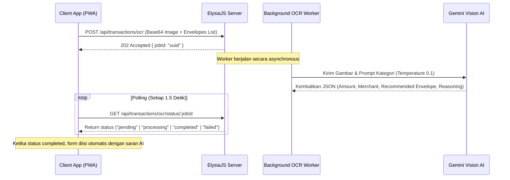

# Dokumentasi Integrasi Gemini AI — FamiVault

FamiVault menggunakan **Gemini AI** (melalui proxy API OpenAI-compatible) untuk menyediakan fitur otomasi pencatatan keuangan pintar bagi pasangan suami istri. Fitur ini dirancang untuk membaca bukti transaksi fisik maupun digital dan secara cerdas menyarankan kategori amplop anggaran yang tepat.

---

## 1. Alur Pemrosesan Latar Belakang (Asynchronous Worker)

Untuk mencegah bottleneck thread server dan menghindari gateway timeout (karena pemrosesan visual AI dapat memakan waktu 4 hingga 8 detik), FamiVault menggunakan arsitektur **Asynchronous Job Worker** berbasis memori (`Map`):



### Penanganan Kebocoran Memori (Memory Cleanup)

Setiap kali endpoint `POST /transactions/ocr` dipanggil, API akan secara otomatis membersihkan daftar job yang usianya sudah melebihi 10 menit untuk menjaga efisiensi RAM server:

```typescript
const now = Date.now();
for (const [id, job] of ocrJobs.entries()) {
  if (now - job.createdAt > 10 * 60 * 1000) {
    ocrJobs.delete(id);
  }
}
```

---

## 2. Konfigurasi Environment Variable

Untuk mengaktifkan integrasi Gemini AI di lingkungan pengembangan lokal maupun produksi, konfigurasikan berkas `.env` di dalam `packages/api/.env`:

```env
# Gemini AI (OpenAI-compatible proxy)
AI_BASE_URL=https://ai.dvlpid.my.id/v1
AI_MODEL=gemini-3-flash
AI_API_KEY=sk-af6376fcf20b4a148672456a6cae1902
```

- **`AI_BASE_URL`**: URL server endpoint proxy OpenAI-compatible yang mengarah ke model Gemini.
- **`AI_MODEL`**: Model Gemini yang digunakan (direkomendasikan menggunakan `gemini-3-flash` untuk pemrosesan gambar berkecepatan tinggi dengan biaya rendah).
- **`AI_API_KEY`**: Kunci otorisasi API untuk mengakses layanan model.

---

## 3. Rekomendasi Kategori & Rincian Barang (AI Classifier & Itemizer)

FamiVault mengirimkan daftar amplop anggaran yang aktif milik rumah tangga pengguna ke model AI agar model dapat membandingkan isi struk belanja dengan kategori yang tersedia secara presisi, sekaligus memilah setiap barang belanjaan secara rinci.

### Prompt Sistem

Sistem menggunakan instruksi terstruktur untuk mengekstrak detail transaksi beserta rincian barang belanjaan, memetakan kategori yang tepat, serta mengembalikan data berformat JSON murni tanpa menyertakan blok markdown (` ```json `):

```typescript
let systemPrompt = `Kamu adalah asisten yang mengekstrak informasi transaksi dari gambar struk pembayaran atau screenshot transaksi digital (seperti QRIS dari BRImo).

Ekstrak informasi berikut:
1. amount: Jumlah pembayaran dalam Rupiah (angka saja, tanpa "Rp" atau titik)
2. merchant: Nama toko/merchant/penerima pembayaran
3. date: Tanggal transaksi dalam format ISO 8601 (YYYY-MM-DDTHH:mm:ss)
4. items: Rincian barang/item yang dibeli (jika gambar merupakan struk dengan daftar barang). Setiap item berisi:
   - name: nama item/barang
   - quantity: jumlah/kuantitas
   - price: harga satuan (angka saja)
   - total: total harga item tersebut (angka saja)`;

if (envelopes && envelopes.length > 0) {
  systemPrompt += `\n5. recommendedEnvelopeId: ID amplop yang paling sesuai dari pilihan yang diberikan di bawah ini.
6. analysisReasoning: Alasan singkat berbahasa Indonesia mengapa amplop tersebut dipilih.

Daftar amplop anggaran/kategori pengeluaran yang tersedia:
${envelopes.map(e => `- ID: "${e.id}", Nama Amplop: "${e.name}"`).join("\n")}

Pilihlah salah satu ID amplop di atas yang paling menggambarkan jenis transaksi ini. Jika tidak ada yang cocok sama sekali, gunakan null.`;
}

systemPrompt += `\n\nJawab dalam format JSON saja, tanpa markdown atau penjelasan tambahan di luar JSON...`;
```

### Parameter Penyetelan AI (Temperature)

- **`temperature: 0.1`**: Menjamin respon AI bersifat sangat deterministik dan akurat sesuai fakta yang tertera pada struk belanja, meminimalkan kemungkinan halusinasi AI.
- **`max_tokens: 1000`**: Memberikan ruang yang cukup untuk mengekstrak rincian barang belanjaan yang panjang beserta alasan analisis (_reasoning_).

---

## 4. Struktur Endpoint API

### A. Memulai Analisis OCR Gambar

- **Endpoint**: `POST /api/transactions/ocr`
- **Headers**: `Authorization: Bearer <jwt_token>`
- **Payload**:
  ```json
  {
    "image": "iVBORw0KGgoAAAANSUhEUgAA...", // Base64 String tanpa prefix data URI
    "mimeType": "image/png",
    "envelopes": [
      { "id": "env-1", "name": "Makanan & Minuman" },
      { "id": "env-4", "name": "Kebutuhan Rumah Tangga" }
    ]
  }
  ```
- **Response (202 Accepted)**:
  ```json
  {
    "jobId": "a98b50e2-ddc9-43ef-b387-052637738f61"
  }
  ```

### B. Memantau Status & Mengambil Hasil OCR

- **Endpoint**: `GET /api/transactions/ocr/status/:jobId`
- **Headers**: `Authorization: Bearer <jwt_token>`
- **Response (Pending/Processing)**:
  ```json
  {
    "status": "processing",
    "createdAt": 1780632205414
  }
  ```
- **Response (Success - Completed)**:
  ```json
  {
    "status": "completed",
    "createdAt": 1780632209123,
    "result": {
      "amount": 75400,
      "merchant": "TLOGOMAS 44 MALANG",
      "date": "2026-06-05T10:15:00",
      "rawText": "...",
      "confidence": "high",
      "recommendedEnvelopeId": "env-4",
      "analysisReasoning": "Belanja di Tlogomas 44 mencakup produk kebutuhan rumah tangga.",
      "items": [{ "name": "POP MIE AYAM 75G", "quantity": 1, "price": 4900, "total": 4900 }],
      "formattedNote": "🛒 Rincian Belanja:\n• 1x POP MIE AYAM 75G @ Rp 4.900 (Rp 4.900)"
    }
  }
  ```

---

## 5. Penggunaan di Sisi Klien (Client-Side Integration)

### A. Composable `useOcr.ts`

Fungsi-fungsi pembantu di sisi klien memfasilitasi status pengunggahan berkas, pemuatan pratinjau gambar instan (`localImagePreviewUrl`), serta polling status hasil analisis berkala:

- **`uploadReceiptFile(file: File)`**: Mengubah file gambar ke base64 dan memicu endpoint `/ocr`.
- **`startOcrPolling(jobId: string)`**: Menjalankan interval polling status setiap 1.5 detik hingga job selesai atau gagal.

### B. Pratinjau Detil Rincian Belanja

Hasil `formattedNote` secara otomatis dimasukkan ke kolom Catatan transaksi. Transaksi yang memiliki catatan dengan format ini akan menampilkan tombol ikon keranjang belanja 🛒 di halaman daftar transaksi dan dapat diklik untuk membuka **TransactionDetailSheet.vue** guna menampilkan rincian tabel belanjaan secara interaktif.

---

## 6. Pengujian API Mandiri (Script Lokal)

Untuk mempermudah pengujian koneksi ke API Gemini tanpa menyalakan server web client, Anda dapat menjalankan skrip pengujian berbasis TypeScript di folder `scratch/` menggunakan runtime **Bun**:

```bash
# Jalankan pengujian koneksi dasar Gemini
bun run ~/.gemini/antigravity/brain/ae78dcc6-8b77-4022-a756-f874e9ffd0ab/scratch/test-gemini.ts

# Jalankan pengujian ekstraksi struk OCR dan rekomendasi kategori amplop beserta barang belanjaan
bun run ~/.gemini/antigravity/brain/ae78dcc6-8b77-4022-a756-f874e9ffd0ab/scratch/test-ocr-recommender.ts
```

---

## 7. Rekonsiliasi Saldo & Pipa Rilis APK (Catatan Penting)

### A. Rumus Saldo Tercatat Rekonsiliasi

Sesuai dengan `BUSINESS_PROCESS.md` Bagian F, perhitungan saldo tercatat aplikasi (`expectedBalance`) tidak diambil dari `openingBalance` di data periode karena nilainya sering kali kosong (`0`/`null`) saat rollover otomatis.

Perhitungan yang benar dihitung secara dinamis di level API (`reconcile.ts`):
$$\text{Saldo Tercatat} = \text{Total Alokasi Amplop (allocatedAmount + rolloverAmount)} - \text{Total Pengeluaran}$$

### B. Memicu Pipa Rilis APK Android

Pipa rilis otomatis APK Android (`build-apk.yml`) **hanya** dipicu saat Anda mendorong **Git Tag** baru dengan pola `v*`. Mendorong commit biasa ke branch `main` tidak akan memicu build otomatis.

Langkah rilis versi baru:

1. Naikkan versi client di `apps/client/package.json`.
2. Buat tag baru: `git tag v1.0.xx` (misal: `git tag v1.0.37`).
3. Dorong tag ke remote: `git push origin v1.0.xx`.
